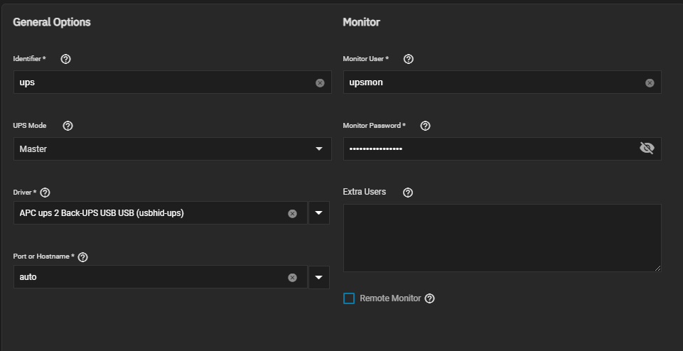

:::info

This chart requires ingress without it you will NOT be able to access the webGUI.

:::

## Prerequisite

In order to get started, plug in your UPS via USB to the `server` node and before modifying the `UPS service` section.

Go to your system shell on your node and run the following command to get the basic info for your UPS.

```shell
nut-scanner -U
```


My UPS uses the `usbhid-ups` driver from `driver = "usbhid-ups"`.

For me though _my_ UPS is _not_ listed in the list, however NUT states you can use others devices of similar models from the same manufacturer as long as its uses the same driver.



You can change the `Monitor User` to whatever you want, I kept it default for simplicity.

I highly recommend securing the `Monitor Password` with a lengthy password. Special characters do work, but only tested a few.

The `UPS Mode` should be set to `Master` which means its the server and _not_ the client.

The `port or hosthame` can be just left at `auto`.


Please set an actual shutdown command, all this will do is echo `shutdown` in the console.


For `Auxiliary Parameters` this is what I used:

```text
LISTEN 127.0.0.1 3493
LISTEN 0.0.0.0 3493
```

## WebNUT Installation

- Set `UPS User` to the username defined for the `Monitor User`.
- Set `UPS Password` to the password defined for the `Monitor Password`.
- Set `UPS Host` to the local IP of your server.
- Set `UPS Port` to `3493` which is typically the default port.

In order to access the webGUI, you will **need** to add `ingress` otherwise it will refuse to connect.

:::info

You can also reach us using Discord for real-time feedback and support
If you found a bug in our chart, open a Github issue but generally it's advised to contact us on Discord first in most cases.

:::
