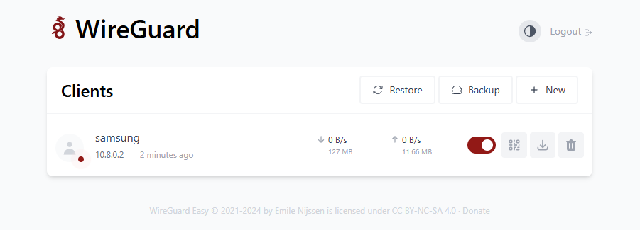

This is a quick how-to or setup-guide to have a local Wireguard server using on your TrueNAS box.
This can be applied to other systems but this specific guide is SCALE specific with the prerequisites.

## Requirements

- Domain name (can be free using DuckDNS or any DDNS) that has your current WAN IP, WAN IP not recommended unless you have a static IP.
  - **Caution**: The domain you use should not be behind a reverse proxy, such as Cloudflare Proxy (disable the proxy on the subdomain on the Cloudflare dashboard. The default is Proxied (orange cloud), set to DNS only (grey cloud)), as it won't accurately represent your real WAN IP. To address this, consider creating a subdomain dedicated to Wireguard and disabling the reverse proxy for that specific subdomain only.
- UDP Port 51820 (or whichever port you specify in Step 4 of the chart setup) Open on your firewall with port-forwarding to your TrueNAS box (this is for the Wireguard Tunnel). This will vary based on the router/firewall setup you're using, for example my Mikrotik has a Firewall rule setup

  
  

- WG-Easy Charts chart

## Prerequisites

For proper access to your local network (LAN), this chart requires two `sysctl` values set on your TrueNAS or system. For TrueNAS SCALE the way to change these values are inside `System` then `Advanced`. On that screen you add the following two values

- `net.ipv4.ip_forward`
- `net.ipv4.conf.all.src_valid_mark`

Set them to `1` and `Enabled`

## Wg-Easy Chart Setup

### Container Configuration

- Change `WG_HOST` _required_ domain name (or WAN IP if you have a Static IP). A domain name cannot be proxied by cloudflare. 
- Change `WG_DEFAULT_ADDRESS` only if it conflicts with other IP addresses on your network
- Change `WG_DEFAULT_DNS` can be set to your local DNS (eg my PiHole box) or a generic one like `1.1.1.1`
- Change `ADMIN_PASSWORD` _required_ - Always best to have some security in front of the GUI page

### Networking and Services

- The default port for the Wireguard UDP service is `51820` and it needs to be accessible outside your network in order for the Wireguard tunnel to work. Therefore if you change this port make sure you change the port on your Firewall as well.

### Security and Permissions

:::caution

Must change the `PUID` to 0 for this chart to work

:::

> **Recommended** If you're creating multiple users setting up Ingress for the Portal/GUI page is a secure and easy way to download your Wireguard configs or use the handy QR code scanner from your mobile device with the Wireguard app on iOS or Android.
>
> 

There's a few options in the upstream container that aren't present by default in this chart that can be added as environment values. Please refer to the [upstream](https://github.com/weejewel/wg-easy) documentation as necessary and add those ENV VARS at your discretion without any support.

## Support

- If you need more details or have a more custom setup the documentation on the [upstream](https://github.com/weejewel/wg-easy) is very complete so check the descriptions of the options there.
- You can also reach us using [Discord](https://discord.gg/tVsPTHWTtr) for real-time feedback and support
- If you found a bug in our chart, open a Github [issue](https://github.com/truecharts/apps/issues/new/choose)

---

All Rights Reserved - The TrueCharts Project
