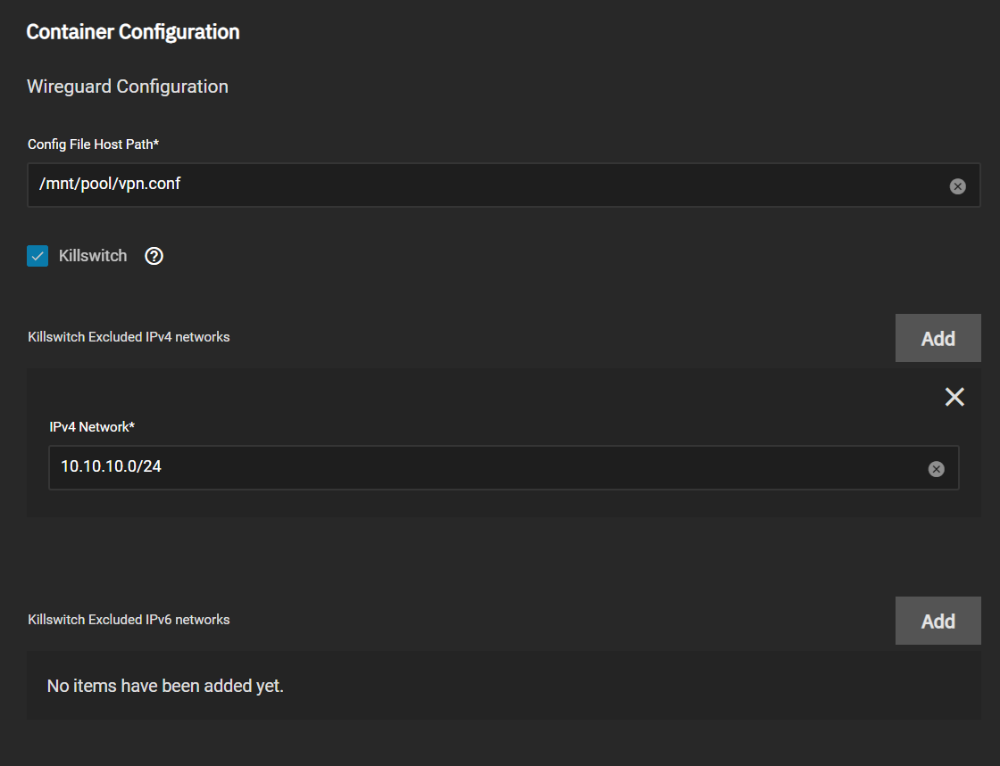

## Scale App

TrueNAS Scale users, can configure this app from the easily from the UI.
Store your wireguard config file in a directory, on one of your pools.
Example `/mnt/pool/vpn.conf` (Name can be any name. eg `wg0.conf`, `x-site.conf`, etc)
Example config content:

```toml
[Interface]
Address = 10.0.0.1/24
ListenPort = 51820
PrivateKey = PRIVATE_KEY

[Peer]
PublicKey = PUBLIC_KEY
AllowedIPs = 0.0.0.0/0
Endpoint = wg.example:51820
```

UI Configuration is simple as that:



Tick `Killswitch` if you want to kill traffic when VPN is down.
Add networks in `Excluded IPv{4,6} Networks` that you want to continue their traffic when VPN is down.

That's it!

## Native Helm

Native helm users can modify `values.yaml` and add their wireguard config directly in there.

Example:

```yaml
wg:
  # Set to true if you want to enable killswitch
  killswitch: false
  # If you want to exclude networks, do like so
  excludedIP4networks:
    - "10.10.10.0/24"
    - "192.168.1.0/24"
  excludedIP6networks: []
  # Leave empty if you going to use the paste your config bellow
  configFileHostPath: ""
  # Paste your config bellow.
  # Indentation matters!
  config:
    enabled: false
    # Your wg config here eg:
    data: |
      [Interface]
      Address = 10.0.0.1/24
      ListenPort = 51820
      PrivateKey = PRIVATE_KEY

      [Peer]
      PublicKey = PUBLIC_KEY
      AllowedIPs = 0.0.0.0/0
      Endpoint = wg.example:51820
```
