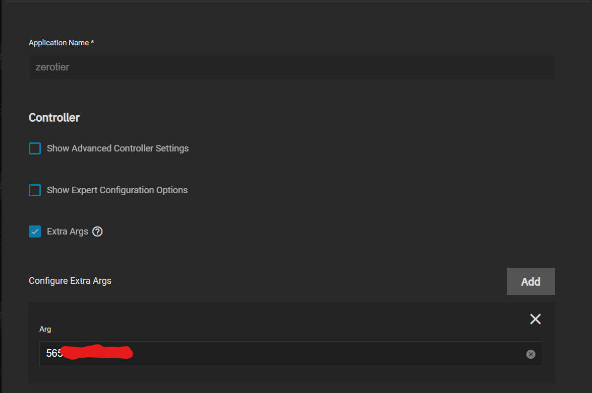

# How-To

This is a quick how-to or setup-guide to use Zerotier using on your TrueNAS box.
This can be applied to other systems but this specific guide is SCALE specific with the prerequisites.

## Requirements

- Zerotier Account (Free accounts available at [Zerotier's Official website](https://www.zerotier.com))
- Zerotier Truecharts Chart

## Prerequisites (LAN access only)

For proper access to your local network (LAN), this chart requires two `sysctl` values set on your TrueNAS or system.
For TrueNAS SCALE the way to change these values are inside `System Settings` then `Advanced`.
On that screen you add the following two values:

- `net.ipv4.ip_forward`
- `net.ipv4.conf.all.src_valid_mark`

Set them to `1` and `Enabled`

Also prepare your Zerotier Network ID for your setup, easy to create and copy at [https://my.zerotier.com](https://my.zerotier.com)

## Zerotier Chart Setup

Ideally name your chart `Zerotier` but you can use any name here and leave defaults for Step 2

- Extra Args:

If you wish to automatically join a specific Zerotier Network upon startup simply enter the `Network-ID` in this space.
**Note** This is not required for the chart to run but is **highly recommended**.

- Container Configuration:

  - `ZEROTIER_API_SECRET`: Replaces the authtoken.secret before booting and allows you to manage the control socket's authentication key
  - `ZEROTIER_IDENTITY_PUBLIC`: The identity.public file for zerotier-one. Use zerotier-idtool to generate one of these for you.
  - `ZEROTIER_IDENTITY_SECRET`: The identity.secret file for zerotier-one. Use zerotier-idtool to generate one of these for you.

  

Networking and Services:

- The default ports are fine for this chart, you shouldn't need to port forward or open ports on your router.
  However many people will want to access their SMB shares or TrueNAS GUI via Zerotier.
  In order to do so you will have to ensure the screen is setup as below and enable `Host-Networking`.

## Support

- You can also reach us using [Discord](https://discord.gg/tVsPTHWTtr) for real-time feedback and support
- If you found a bug in our chart, open a Github [issue](https://github.com/truecharts/apps/issues/new/choose)

---

All Rights Reserved - The TrueCharts Project
