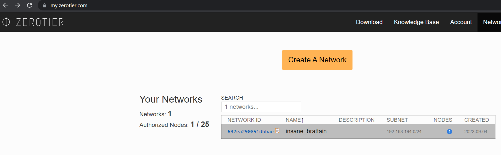

This is a quick how-to or setup-guide to use Zerotier.

## Requirements

- Zerotier Account (Free accounts available at [Zerotier's Official website](https://www.zerotier.com))
- Zerotier Truecharts Chart

## Prerequisites (LAN access only)

### Zerotier Network ID
Prepare your Zerotier Network ID for your setup, easy to create and copy at [https://my.zerotier.com](https://my.zerotier.com)



### Sysctl
:::note[sysctl]

This part is not needed for CLustertool setup with TalosOS.

:::


At some OS's it is required to set two `sysctl` values for proper acces to your local network (LAN). Check your OS documentation how this needs to be done.
```
net.ipv4.ip_forward = 1
net.ipv4.conf.all.src_valid_mark = 1
```

## Zerotier Chart Setup

Ideally name your chart `zerotier`.

### Global Pod Options
:::danger[hostNetwork]

Host-Network is not recommended and cause side effects. Usage is not supported.

:::

If you wish to use `Host-Networking` or create an interface (`zerotier creates a network interface`)

```yaml
podOptions:
  hostNetwork: true
```

### Chart Configuration

Configuration can be done via the following environment variables:

- `ZEROTIER_API_SECRET`: Replaces the authtoken.secret before booting and allows you to manage the control socket's authentication key
- `ZEROTIER_IDENTITY_PUBLIC`: The identity.public file for zerotier-one. Use zerotier-idtool to generate one of these for you.
- `ZEROTIER_IDENTITY_SECRET`: The identity.secret file for zerotier-one. Use zerotier-idtool to generate one of these for you.

```yaml
workload:
  main:
    podSpec:
      containers:
        main:
          env:
            ZEROTIER_API_SECRET: ""
            ZEROTIER_IDENTITY_PUBLIC: ""
            ZEROTIER_IDENTITY_SECRET: ""
```

### Extra Args

If you wish to automatically join a specific Zerotier Network upon startup simply enter the `Network-ID` in this space.
**Note** This is not required for the chart to run and may not always work.

```yaml
workload:
  main:
    podSpec:
      containers:
        main:
          args: arg
          extraArgs:
            - extraArg
```

### Networking and Services

- The default ports are fine for this chart, you shouldn't need to port forward or open ports on your router.

## Support

- You can also reach us using [Discord](https://discord.gg/tVsPTHWTtr) for real-time feedback and support
- If you found a bug in our chart, open a Github [issue](https://github.com/truecharts/apps/issues/new/choose)

---

All Rights Reserved - The TrueCharts Project
