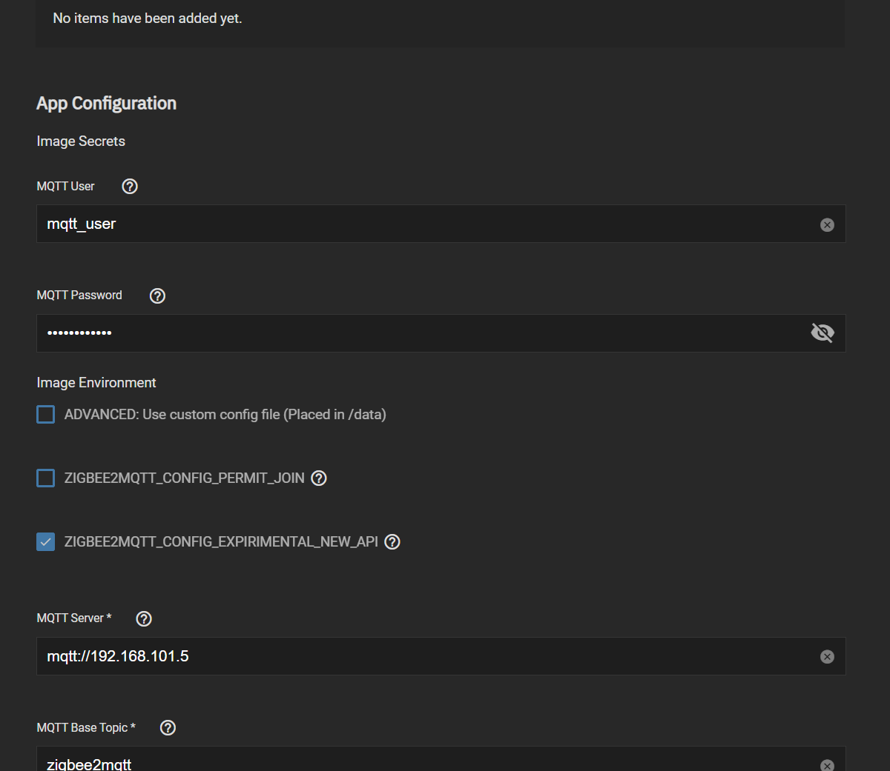
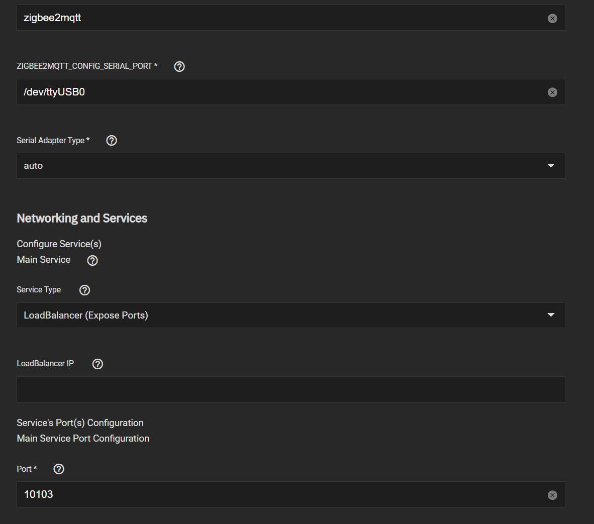
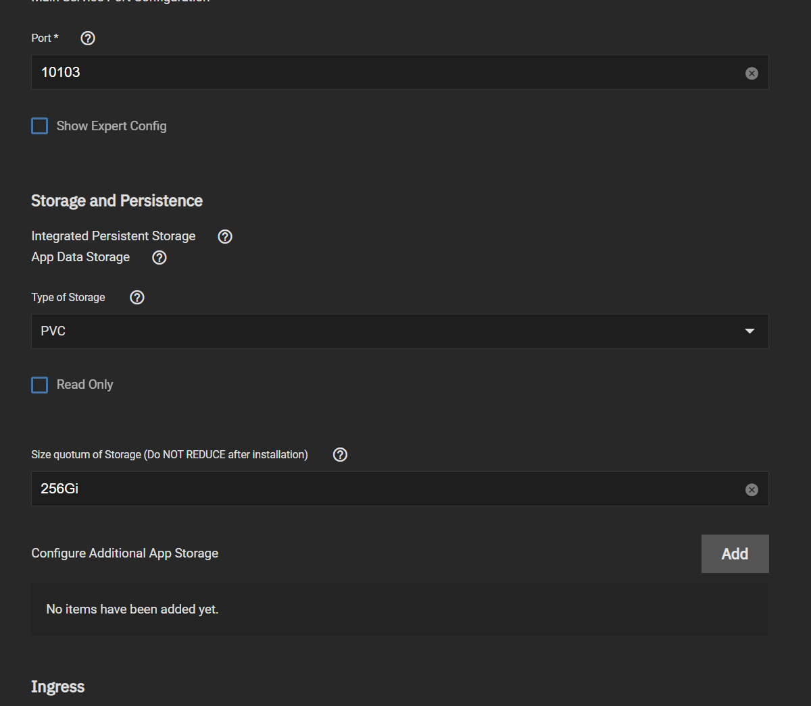
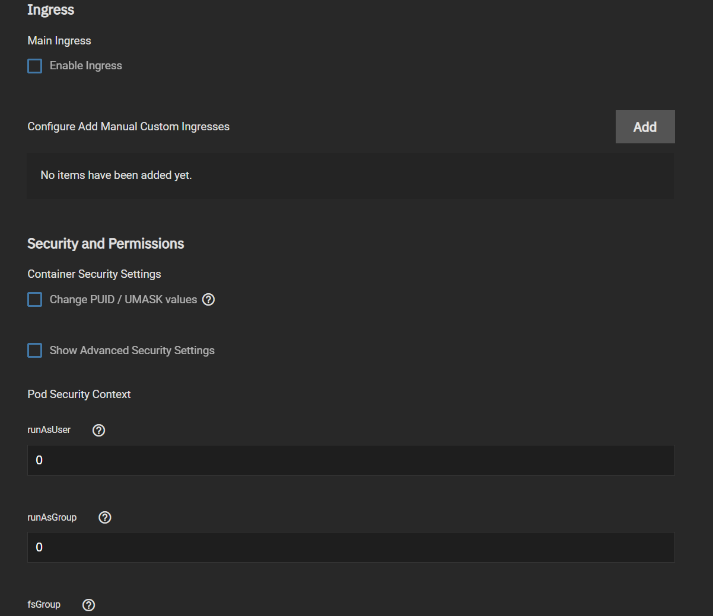
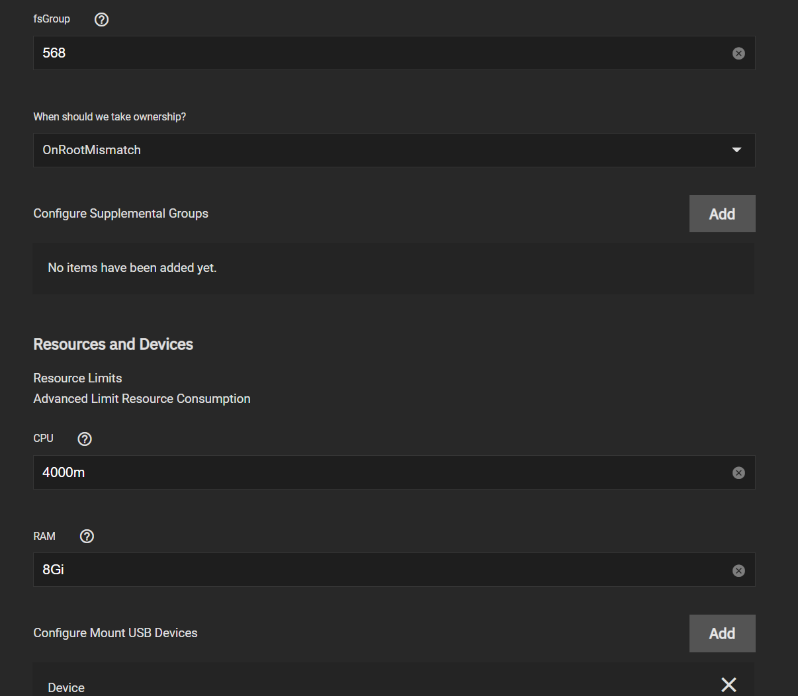
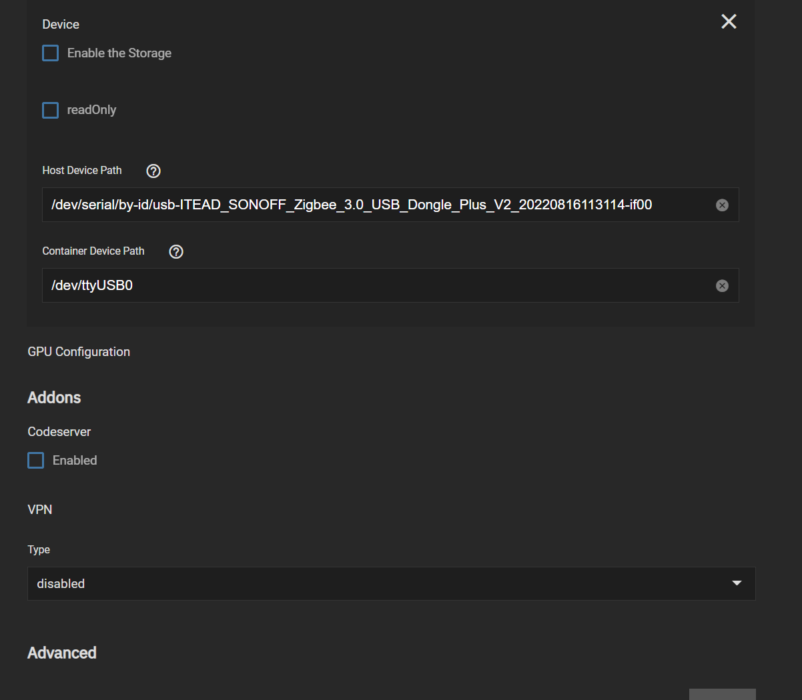
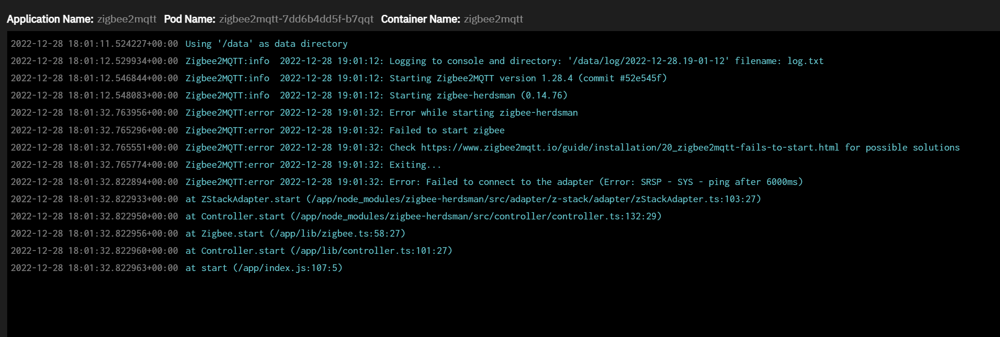
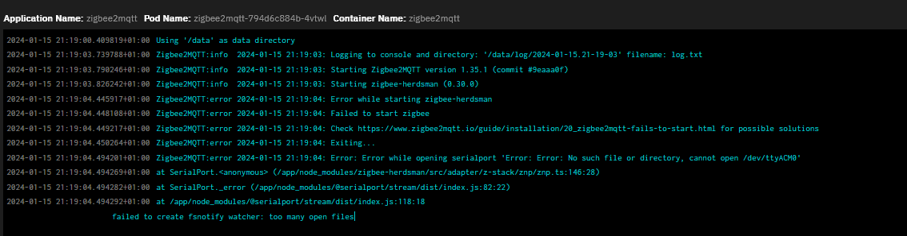

## TrueNAS SCALE Installation Hints

Here's an example of a default installation of zigbee2mqtt. Pay particular attention to the section "Configure Mount USB Devices" to configure the USB adapter to your container as those two paths should match.

### Application Configuration

Enter `MQTT User`, `MQTT Password` if necessary, as this will override the specific value of config file. Leave empty if you plan to use custom config or you don't have set a user on your MQTT broker.

For `MQTT Server` Internal DNS Cluster IP can be used (default) of `mqtt://mosquitto.ix-mosquitto.svc.cluster.local` or you can use the external IP.

### Mount USB Devices

Make sure `Enable the Storage is Checked` and enter your USB device by ID as per below, in this example we use `/dev/serial/by-id/usb-ithead_SONOFF`

This guide should prevent one of the following error messages:

