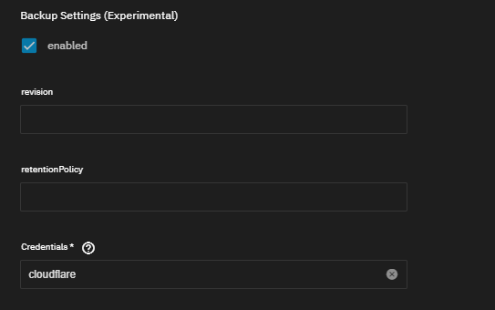

---
sidebar:
  order: 1
title: 'TrueNAS SCALE -> ClusterTool'
---

:::caution[Work In Progress]

This program, all its features and its general design, are all a Work-In-Progress. It is not done and not widely available.

All code and docs are considered Pre-Beta drafts

:::

With the upcoming 24.10 "Electric Eel" version of TrueNAS SCALE, iX-Systems has decided to completely gut the Kubernetes backend of SCALE. However, we've got you covered so you can safely keep running your TrueCharts Charts.

Our new ClusterTool can, among other things, be used to craft yourself a new kubernetes backend to continue self-hosting using TrueCharts. For this guide we'll be using a TalosOS VM on TrueNAS SCALE, but any solid hypervisor would suffice.

## Pre-Migrations Advisory

Prior to migration, we require the following to be done:

### **DO NOT** update to Electric Eel

As soon as you migupdaterated to TrueNAS SCALE 24.10 "Electric Eel", you cannot, in any way, migrate your TrueCharts Apps anymore.

### Ensure all "hostPath" storage is replaced with "NFS"-share based storage

With the future migration to Talos using ClusterTool, you won't technically be able to reach these folders through "hostPath" anymore.
Please ensure to make a *seperate* NFS share on TrueNAS SCALE for each of those folders and edit the TrueNAS SCALE App to point towards said share directly.

Please be sure to use the publicly reachable IP of the TrueNAS server and not `127.0.0.1`.

To ensure a stable running environment, we would strongly advise you to ensure the TrueNAS SCALE host running NFS, uses a static IP and does *NOT* use a DHCP-supplied IP address, typically from your modem/router.

Ensure you setup the permissions on the Dataset according to [this](https://truecharts.org/ guide.

And configure the NFS Shares according to [this](https://truecharts.org/ guide.

We  also *heavily* advise that config storage should almost *always* be set to "PVC" and not *hostPath* nor *NFS*.  If you did decide on using NFS storage for config, we cannot take responsibility if the migration fails.

### NFSv4 Requirement

Our default ClusterTool Talos setup, requires NFSv4 to be enabled on any shares used.
Not doing so beforehand, might lead to issues.

### Ensure all PVC storage has VolSync backups (not restore) Enabled

While we've not fully finished our design docs, there are big chances those are going to require you to already have VolSync backups of any PVC present.

Please follow the guides for setting-up VolSync backups on TrueNAS SCALE. However, setting recovery is not needed and currently not functional on our TrueNAS SCALE Apps. Hence this can be safely skipped.

Setup VolSync according to [this](https://truecharts.org/ guide.

*If you currently do not have VolSync installed, a migration-specific catalog will be provided at a later date to install it prior to migration*

### Ensure all CNPG/Postgresql sections have their backups **enabled**

CNPG/postgresql data is not backed up using volsync but uses their own backup solution.
Its imperative to setup those backups seperately as described in [this](https://truecharts.org/ guide.

### Note on other databases and their backups

We cannot guarantee the integerty of included:
- MongoDB databases
- Redis Databases
- MariaDB databases

Those might get wiped on migration.

### Keep Existing Data Around

We cannot guarantee everything goes smoothly. Hence we would advice to "unset" the Apps pool, but **do not** remove the `ix-applications` dataset before you've verified your new cluster and its Apps are fully up-and-running. Deleting of Apps and/or the `ix-applications` dataset leads to permanent irreversable dataloss.

#### Cobia specific

When still on TrueNAS SCALE 23.10 "Cobia", we would advice using Heavyscript to make Backups of the Apps system as well.

## Continue with ClusterTool Getting-Started

From this point onwards, please go through the complete [ClusterTool Getting-Started](/clustertool/getting-started) guide.

## Migration

### Important note

We do not sanitise the exported/migated configuration from SCALE.
You yourself are responsible to move any sensitive data to `ClusterEnv.yaml` variables and references them in `helmrelease.yaml` as `${NAMEOFVARIABLE}`

An easy way (GUI) to do this, is stopping the Apps and then editing all SCALE Apps and replacing the sensitive data before export.
In a lot of cases you can even, already, change them into a `${NAMEOFVARIABLE}` format!

This will "break" the Apps from running in SCALE, but guarantees the sensitive data is not ever exported.

### Exporting SCALE Apps

Ensure you git-cloned your Cluster git repository, setup during [ClusterTool Getting-Started](/clustertool/getting-started), onto your TrueNAS SCALE machine.
You can run now `./clustertool scale export`, to export a complete dump of the configuration values for your SCALE Apps.
This command does NOT remove passwords and other credentials from the export files. You're responsible yourself to (re)move them!

Afterwards, ensure you run `git add . && git commit -m "Exported SCALE App config" && git push`

### Converting SCALE Apps to Helm-Release files

:::danger

MANUALLY CHECK YOUR VALUES
Get rid of as much as possible.

Remember: the default values file would be completely empty.
Only add things you also explicitly and manually have added to SCALE before.

:::

- Move back to your main machine running ClusterTool and ensure your gotten your latest additions to your Cluster GIT repository, by running: `git pull`
- Run `./clustertool scale migrate` to convert all exported SCALE Apps to ClusterTool/FluxCD compatible Helm-Releases
- Remove any, unwanted, changes (or duplicates of) to any charts included by clustertool by default.
- Please do a first setup without any addons and, where possible and reasonable, without ingress.
- run `./clustertool init` and `./clustertool genconfig` again to ensure a fluxcd compatible directory structure is loaded

### Alterations for CNPG restore

The same issues with CNPG restores discussed in [this](https://truecharts.org/ guide, also Apply to other clusters/deployments other than TrueNAS SCALE.
Primarily the requirement to set the bootstrap mode to recovery and having to change the revision numbers on both the backup and restore sections.

So to restore your CNPG backup made on SCALE< please ensure this is done before loading onto the cluster

### Loading Into the Cluster

We heavily advice using FluxCD to keep all your charts synced with your github repository as-well-as allow for automated updates.

In case you do not, we've made an alternative for `helm install` and `helm upgrade` that uses the values defined in the `helmrelease.yaml` files instead of `values.yaml`.
This ensures the migration is compatible with both "plain" clusters as well as FluxCD

#### The FluxCD way

- Push the files to your Git Repo Flux should automatically pick it all up.

#### The Helm Way

Run the following for each chart you want imported (altered accordingly):
`./clustertool helmrelease install cluster/main/kubernetes/path/to/my/helmrelease/file.yaml`

If you ever need to do alterations/updates/upgrades manually, there is also a command for that:
`./clustertool helmrelease upgrade cluster/main/kubernetes/path/to/my/helmrelease/file.yaml`

## Known Issues

### VolSync backups broken
In some cases VolSync might not backup your data.
If everything is setup correctly, you can ask our support staff to verify, there is currently not much we can do about this upstream bug.

### TrueNAS SCALE 24.10 "Electric Eel" not supported

Its **NOT** possible *in any way* to do the migration after updating to TrueNAS SCALE 24.10 "Electric Eel"

### MariaDB, MongoDB and Redis data wont migrate

This is correct, all this data will NOT migrate.
This cannot be helped or patched.

## Setting up Backups and Restore on TrueNAS SCALE

:::danger

TrueNAS SCALE Apps are considered Deprecated. We heavily recommend using a more mature Kubernetes platform such as "TalosOS" instead, and no longer offer an apps/charts catalogue for SCALE users to install. The below docs exist purely as historical references and may be removed at any time.

:::

:::caution[The below is a work in progress]

We've recently completely reworked the way we handle backups, moving away from platform-specific solutions to a "one size fits everyone" system using VolSync and CNPG backups. We're also making it known that the prior version of this guide will **not** work on TrueNAS SCALE 24.04.X "DragonFish". This updated guide has been written with the best efforts of the staff and tested as best possible. We are not responsible if it doesn't work for every scenario or user situation.

:::

### Requirements

#### System Apps

As this is a SCALE-specific guide, we expect users to have fully followed the SCALE quick-start [guide](/ and hence have installed _all_ [operators](/ from the `system` train as listed there. This includes `VolSync`, which depends on `Prometheus-Operator`, so ensure you have installed `Prometheus-Operator` prior to installing `VolSync`.

#### S3 Provider Setup

### Backup Configuration

:::caution[Credentials]

Do not add the credentials inside the VolSync chart. This won't work as they need to be added to each chart individually.

:::

Enter your S3 credentials under the `credentials` section in each app you want to enable backup/restore functionality on.

#### PVC Backups

PVC data can be easily backed up to S3 storage by using our integrated VolSync support. For each individual app, the `VolSync Destination (Restore)` option _must_ set on creation of the app by doing the following:

1. Add `VolSync` to each persistence object you want synced as below

2. Add the name you gave to the S3 credentials earlier, under the `credentials` section of VolumeSnapshots

3. Enable the `VolSync Source (backup)` and/or `VolSync Destination Restore)` options as desired

4. Confirm the data is being sent to your S3 host after ~5 minutes

:::note[Bucket Creation]

You do not have to manually create the bucket beforehand, although this is recommended to ensure the bucket's name is available beforehand.

:::

#### CNPG Database Backups

CNPG-backed PostgreSQL databases have their own S3 backup system. We have integrated it in such a way that they can safely share a bucket with the above PVC backups.

For each app:

1. Add CNPG backups to each database you want backed up like shown below

2. Add the name you gave to the S3 credentials earlier, under the `credentials` section

3. Confirm the data is being sent to your S3 host after ~5 minutes

4. We advise you to set the "mode" to `restore`, this should prevent the app starting with an empty database upon restore.

##### Exporting App Configuration

To be done. This section will contain information to export your App configuration so it can be imported later.

### Restoration Configuration

:::note[SCALE Restore Functionality]

As mentioned in our news post, this new restore functionality isn't yet functional on TrueNAS SCALE due to an [upstream bug](https://github.com/openebs/zfs-localpv/issues/536) with OpenEBS. We've submitted a bug report and will update this page once resolved.

:::

#### Recreating an App

When you've no exported app configuration, you can remake the app while also restoring your PVC and CNPG backups using the steps as follows:

1. Ensure the app name matches the name of the app previously backed up

2. Enter the same S3 credentials from earlier, under the `credentials` section

3. Preferably ensure all other configuration options are set precisely the same as the last time you used the app, to ensure compatibility

#### PVC data Restoration

PVC data restoration will happen automatically before the app starts. Please be aware this can take a while depending on the size of the backup, your connection speed, etc.

#### CNPG Database Restore

Before CNPG will correctly restore the database, the following modifications need to be done after recreating or importing the app configuration:

1. Ensure you've setup CNPG backups as well as restore as it was previously

2. Ensure the "mode" is set to `recovery`

3. Set "revision" on your restore to match the previous **revision** setting on your backup settings

4. Increase the **revision** on your backup setting by 1 (or set to 1 if previously empty)

##### Importing App Configuration

To be done. This section will contain information to import your App configuration so you do not have to manually recreate it.

### Total System Restore and Migration to New System

When on a completely new system, you can easily restore using the above steps with the following caveats:

- On a non-SCALE system, the PVC backend needs to support snapshots
- The apps need to be called **exactly** the same as they were before, preferably using a previously-exported config
- If you've any non-PVC storage attached, be sure that this is still available or apps won't start until this is resolved
