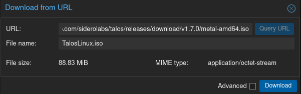
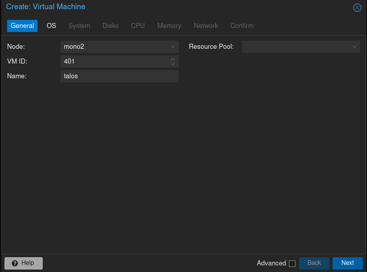
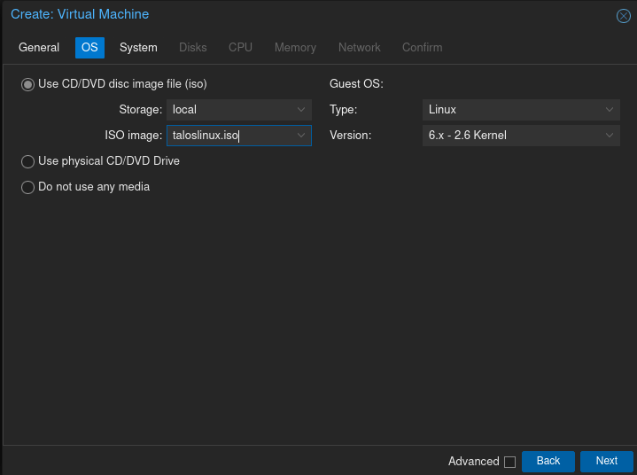
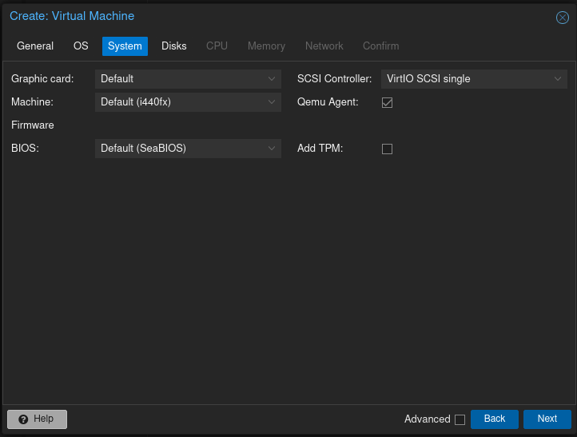
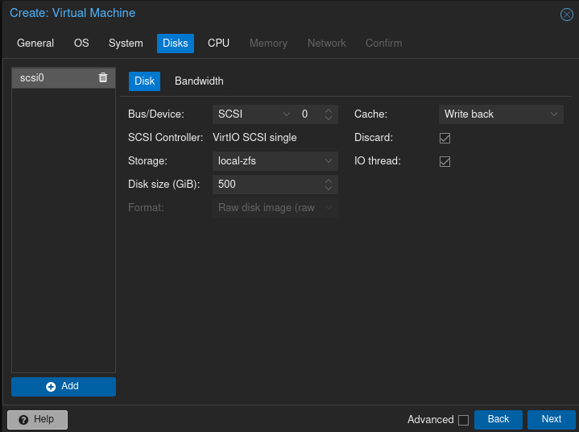
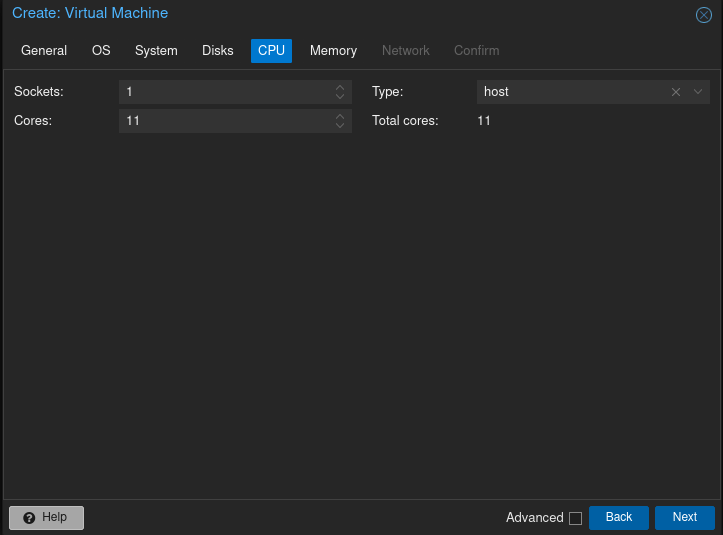
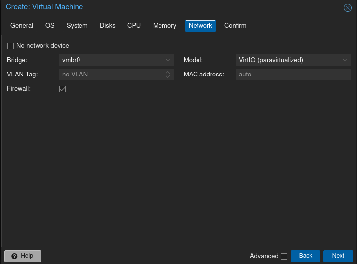
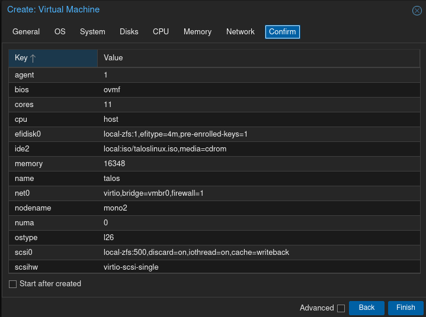

Below are the instructions for creating a Talos VM atop a Proxmox host for use with TrueCharts.

## Downloading Talos

1. Login to Proxmox, select a node, then select a storage repository (e.g. `local`)

2. Select `ISO Images` and then select `Download from URL`

3. Paste the Talos Linux Image link [here](https://github.com/siderolabs/talos/releases/download/v1.7.0/metal-amd64.iso) into the `URL` field

4. Select `Query URL` then name the file `taloslinux.iso`

## Creating the VM

1. Select the blue button `Create VM`

2. Enter a VM ID (e.g. `401`) and name of `talos`

3. Select `Next` to configure the OS

4. Select `taloslinux.iso` for `ISO image`

4. Select `Next` to configure the system

5. Check the box for `Qemu Agent`

6. Select `SCSI Controller` by choosing `VirtIO SCSI single`

7. If you have a dedicated graphics card select it from the list in `Graphic card`

8. Select `Next` to configure disks

9. Select a storage repository (e.g. `local-zfs`)

10. Set the disk size to `500` or `1000`

11. If using an SSD, then for the cache select `Write back` and check the box for `Discard`

12. Select `Next` to configure CPUs

13. Select the sockets (e.g. `1`) and amount of cores to be one less than the total available processor threads (e.g. if you have a 6 core processor with HyperThreading then there are 12 available threads and the value should be `11`.)

14. Select `Next` to configure memory

15. The minimum memory value should be `8192` and the recommended value is `16384` or more Megabytes

16. Select `Next` to configure network

17. Select a bridge such as the default `vmbr0`. Optionally add a VLAN tag

18. Select `Next` to confirm

19. Review settings and optionally select the box for `Start after created` then select `Finish`.

