import { Steps } from "@astrojs/starlight/components";

Below are the instructions for creating a Talos VM atop a TrueNAS SCALE host for use with TrueCharts.

## Creating a Network Bridge

A network bridge will be needed for running a VM inside of SCALE and to be able to reach the SCALE host machine. To create a Bridge network, open your TrueNAS Scale Web UI and go to the Network tab.

:::caution[Network]

We will be modifying the main network interface for your TrueNAS server. Do not click `Test Changes` before it is mentioned in the guide. If you click `Test Changes` before you do you will loose connectivity to the server.

:::

### Preparation

#### Acquire Interface Settings
Note down the interface IP Address and the Subnet mask of your currently used interface.

This can be found through the WebUI:

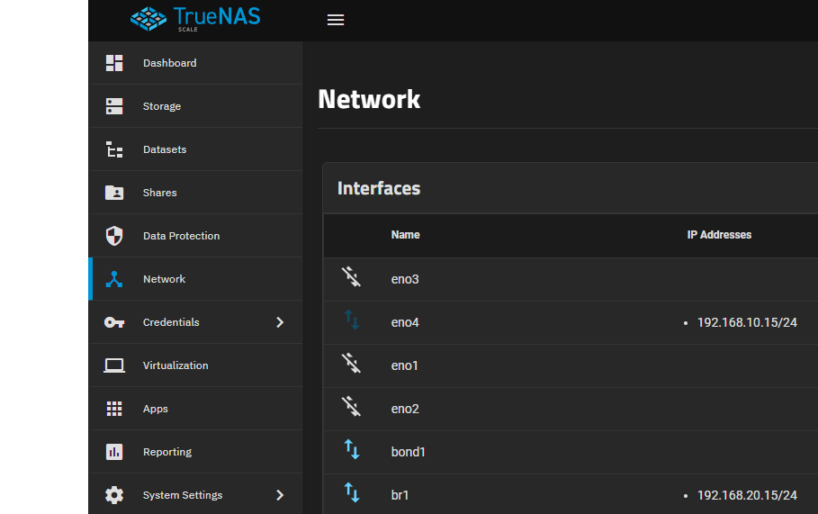

Or through the Console with option "1) Configure network interfaces":

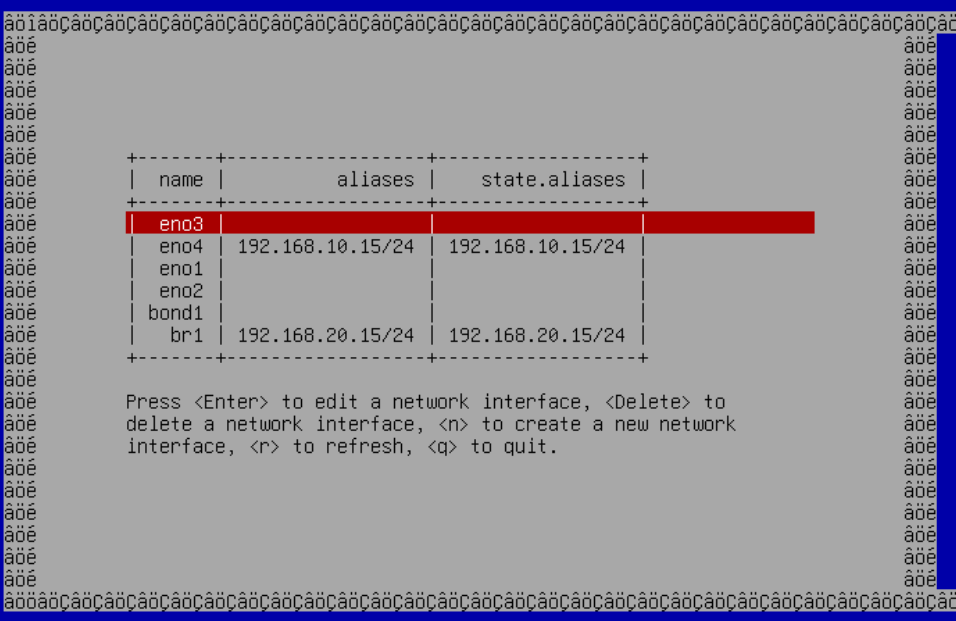

#### Make sure the TrueNAS Apps service is not using the IP for the node IP
If the current node IP is the IP address the we retrieved in the previous preparation step you will not be able to remove the IP Address from the interface in the next steps.

To resolve this add an IP address in another subnet to a interface and bind the apps service to that interface temporarily. When you do this the Apps service will crash if normal network behavior is not possible through the IP/interface.

Once done you can reset the settings to the new bridge interface at which point the Apps service will restart.

To change this using the TrueNAS web UI go to "Apps" -> "Settings" -> "Advanced Settings".

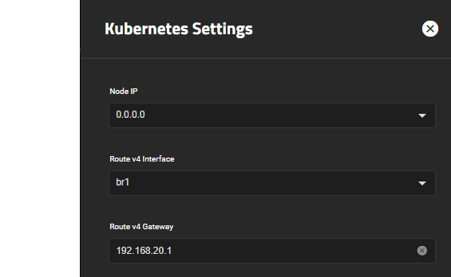

Change:

<Steps>

  1.  Node IP to the temporary IP (and back once done)

  2.  Route v4 Interface to the interface that IP is on (and back once done)

  3.  Route v4 Gateway to a address in the subnet for the temporary IP (and back once done)

</Steps>

### Removing the Alias from the main interface

<Steps>

  1.  Click on `Edit` on the currently used interface

  2.  Disable "DHCP" and remove all "Aliases" by clicking on the x next to them

</Steps>

The Network Interface should then look like this:

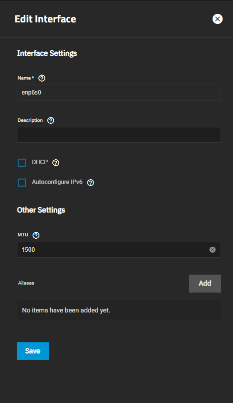

:::caution[Settings not applied]

Make sure the network interface overview does not show the IP on the interface. If it does something went wrong. If you repeat this using the TrueNAS console it will give you a error message explaining what went wrong.

This probably means the IP Address is bound to something within TrueNAS. See the "Preparation" section for guidance.

:::

### Creating the Network Bridge

<Steps>

  1. Click on `Add` in the top-right corner of the interfaces section

  2. Select the type `Bridge` and give it a Name. Note that this name **cannot** be changed afterwards, so you might want to add a meaningful description to it

  3. Add your network interface as a Bridge Member. (In this example: enp6so)

  4. Set the `MTU` to "1500"

  5. In the Alias section, click on `Add` to create a new IP address field

  6. Enter the IP address and Subnet mask you previously took note of

  7. Click `Test Changes` and confirm the prompt. Wait a bit for the UI to become responsive again
    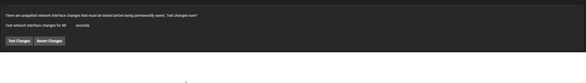

  8. Click on `Save Changes` to save the changes you have made

  9. If something goes wrong and the UI stays unresponsive, the changes will be reverted after 60 seconds.

</Steps>

The bridge should now look similar to this one when done:

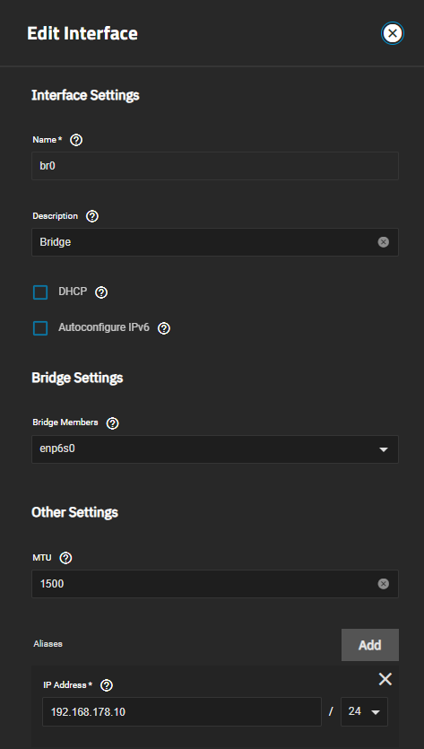

:::caution[Previous step failed]

If TrueNAS gives an error that is cannot add the Address because the subnet is already in use this means the previous step "Removing the Alias from the main interface" failed.

Go back to the "preparation" section and make sure the IP you are trying to move is not in use.

:::

## Creating ZVOL storage for the VM

<Steps>

  1. Start by going to the `Datasets` section of your TrueNAS Scale WebUI

  2. Select the dataset you want the files for the VM to be stored on, as below
    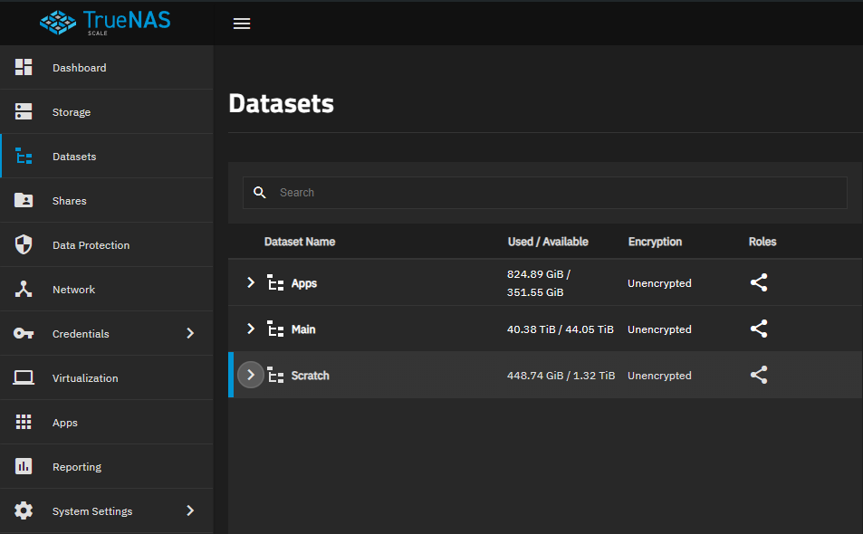

  3. Click the `Add Zvol` button on the top-right

  4. You will be presented with a pane of potential options. Leave all of these as default except for `Zvol name` (call it something recognizable like `Talos zvol`), `Size for this zvol` (set to between `256GiB` and `512GiB`), `Force size` (check this option), `Sparse` (check this option) and `Block size` (change to `128 KiB`)

  5. Set `Sync` to disabled.

  6. We do **not** recommend to encrypt the dataset

  7. After you are done it should look similar to this:
    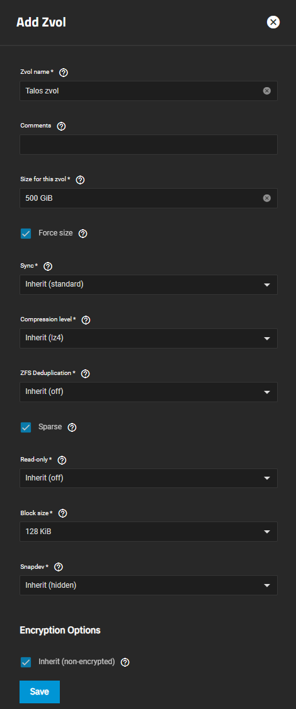

  8. Hit `save` and wait for the system to create the Zvol. The GUI should refresh and then show your Zvol in the list of datasets like so
      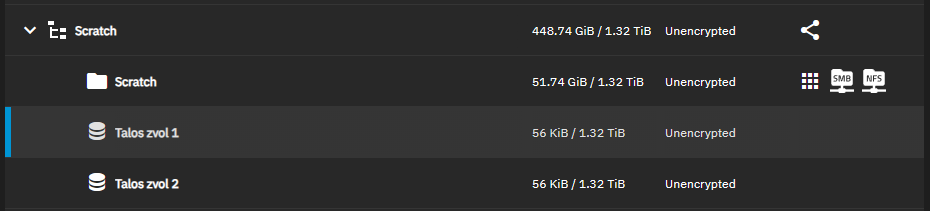

</Steps>

## GPU Isolation

Skip this step if you do not intend to pass a GPU through to the Talos VM.

<Steps>

   1. Go to `System Settings` > `Advanced` in your SCALE UI and scroll down to the section `Isolated GPU Device(s)`

   2. Click on `Configure` on the top right of the section and close the warning

   3. Select the GPU you want to Isolate and use for your VM in the dropdown. Like shown here
    

   4. Click `Save`. This might take a bit

   5. It should now show your isolated GPU in the section. You may need to hard-refresh your browser's page with CTRL + F5 for it to update due to SCALE GUI issues.

</Steps>

## Creating the VM

<Steps>

  1. Start by going to the `Virtualization` section of your TrueNAS Scale WebUI

  2. If you want to assign a GPU to the VM, make sure to [isolate](#gpu-isolation) the GPU first

  3. Click on `Add Virtual Machines`

  4. We also highly suggest users to set a [fixed DHCP-Lease](#fixed-dhcp-lease) (aka static IP) for your VM inside your modem/router.

</Steps>

### Operating System

Select the options like shown below. Make sure to remember the password you have set!

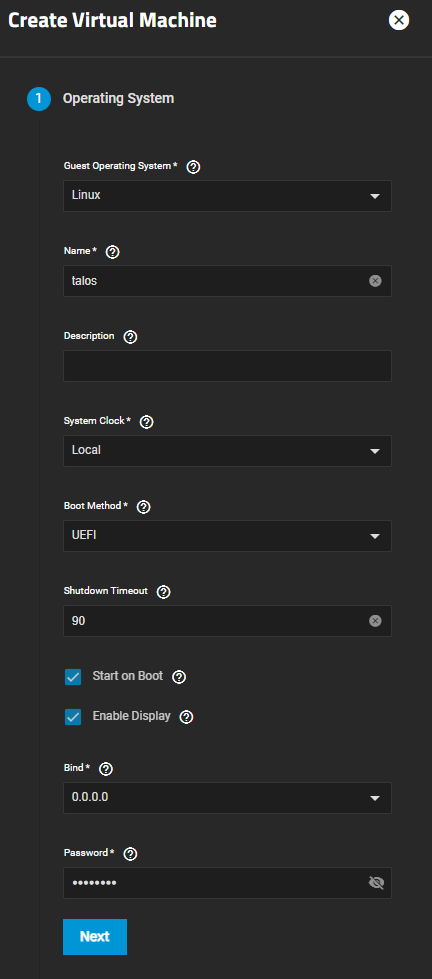

### CPU and Memory

1. Select the amount of `Cores` and set the `Threads` to `2` if your CPU supports HyperThreading like in the example below. We suggest you to add available host system cores minus 1 for your host system

2. Make sure to allocate enough `RAM` towards your VM with the `Memory Size` setting.

Minimum amount of RAM: `16GB`

Minimum recommended amount of RAM: `32GB`

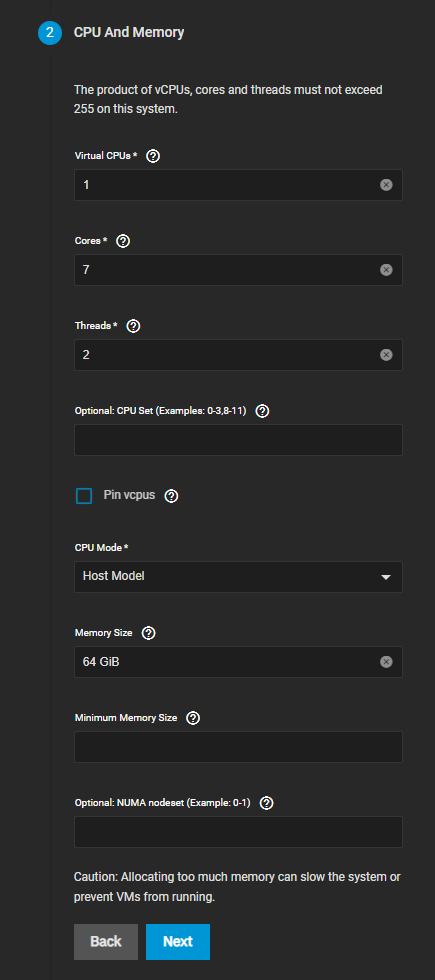

### Disk

Select the previously created Zvol for your VM as shown below:


### Network Interfaces

Change the `Attach NIC` to the Bridge you created in the beginning of the guide

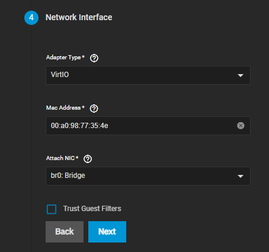

### Installation Media

1. Download the Talos Linux image [here](https://github.com/siderolabs/talos/releases/download/v1.8.0/metal-amd64.iso) and save it to your PC

2. Click on `Upload New Image File` in the VM Creation Screen and choose `Choose File` and select the downloaded ISO. Make sure to select a location _on your SCALE host_ where you want to save your ISO to. An example can be seen below:

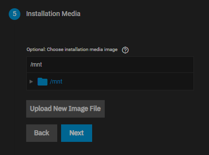

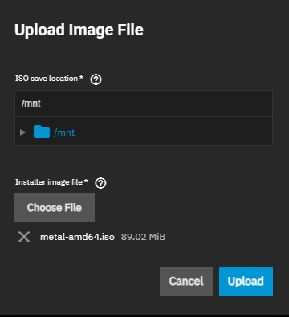

### GPU

Make sure your GPU is [isolated](#gpu-isolation) before you try to assign it to your VM. If you don't want to assign a GPU to your VM, just click `Next` and skip this part of the guide.

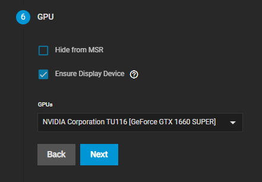

### Confirm Options

If you followed this guide correctly, the options shown should look similar to the screenshot below. Make sure everything is correct and then click on `Save` to finish the VM setup.

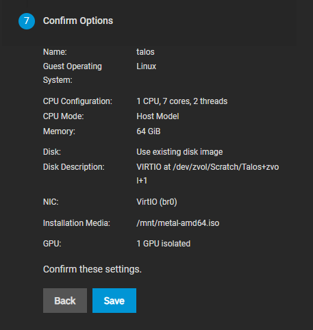

## Fixed DHCP Lease

Below you can find 2 examples on how to set a fixed DHCP Lease for UniFi and Fritzbox hardware.

### UniFi

1. Open your UniFi UI and go to the Client View (highlighted in blue on the screenshot)

2. Click on the Client that represents your VM (not your SCALE Host System)

3. Select `Fixed IP-Address` in the pop-up menu on the right, enter the IP address you'd like to reserve for the VM, and hit `Apply Changes`. Note that you will need to restart the VM from within SCALE to get it to update its IP address if you changed it.

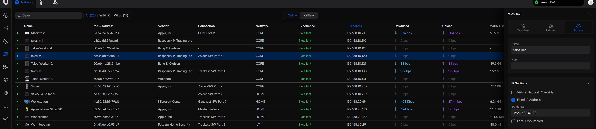

### FritzBox

1. Go to your FritzBox web-interface. Navigate to `Home Network`> `Network` and select the running VM (not your SCALE Host System)

2. Click on the `Edit` button and scroll down to the IP-Address in Home Network section

3. Check `Always give this device the same IP`.

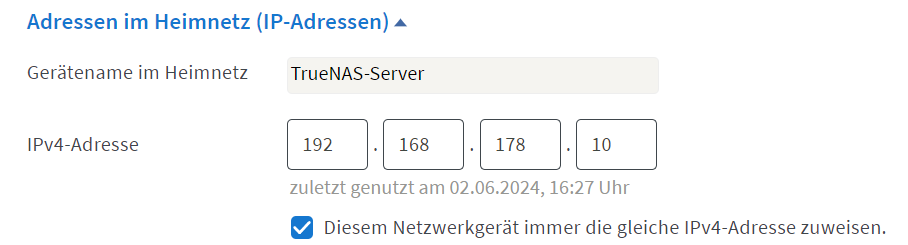
(screenshot in german)

## Post-Installation steps

To make sure your Talos cluster starts correctly after restarting the VM, don't forget to remove the Installation Media ISO after you initialized the cluster.

You can do this by going to `Virtualization` > Expand your VM > `Devices` and then delete the "CD Rom"-device.


## GPU pass-through Caveats

Users running the Talos VM atop a TrueNAS SCALE host system that want to also take advantage of GPU passthrough to the VM will require a **minimum** of 2 *different* GPUs to be present in the system.

The GPU desired to be passed through to the Talos VM will need to be [isolated](/clustertool/virtual-machines/truenas-scale/#gpu-isolation) within SCALE.

This could include any of the following combinations:

**GPU1:** Dedicated Nvidia GPU isolated within SCALE for VM passthrough

**GPU2:** Intel/AMD iGPU

or

**GPU1:** Motherboard IPMI GPU

**GPU2:** Intel iGPU or dedicated Nvidia GPU isolated within SCALE for VM passthrough


## Single GPU pass-through (Advanced)

:::caution[Work In Progress]

This requires some knowledge about html and you need to enable developer-mode for it to work.

:::

1. Modify the Python file `/usr/lib/python3/dist-packages/middlewared/plugins/system_advanced/gpu.py`
```python
if len(available - provided) < 1:
  verrors.add(
      f'{schema}.isolated_gpu_pci_ids',
      'A minimum of 1 GPU is required for the host to ensure it functions as desired.'
  )
```

   Comment Out this section (`# ` in front of every line)

2. Delete the whole folder `/usr/lib/python3/dist-packages/middlewared/plugins/system_advanced/__pycache__`

3. Reboot Server or atleast middleware

4. Go to system> advanced and isolate the gpu. (Button will be greyed out and will show the red error thats totally fine)

5. Open he Inspect window of your browser and find the button which is greyed out. Should look like this:
```<button mat-button="" type="submit" color="primary" ixtest="save" mat-ripple-loader-uninitialized="" mat-ripple-loader-class-name="mat-mdc-button-ripple" class="mdc-button mat-mdc-button mat-primary mat-mdc-button-disabled mat-mdc-button-base ng-star-inserted" mat-ripple-loader-disabled="" disabled="true" data-test="button-save">```

6. Remove `"disabled="true"` and `mat-mdc-button-disabled`

7. The error will still be there but you should be able to click the button

Might need to do the same Steps 5 and 6 when assigning the gpu to the VM.
