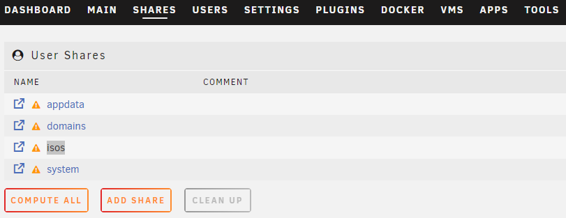
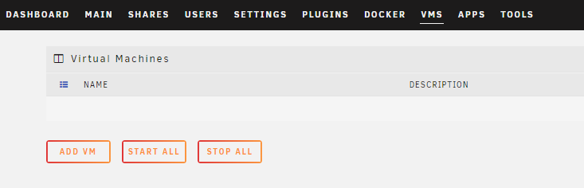
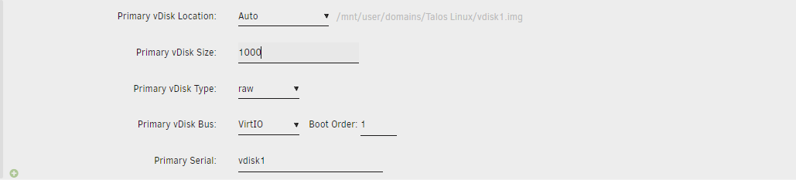
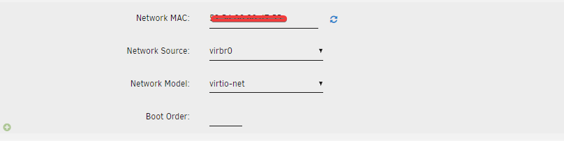

Below are the instructions for creating a Talos VM atop an UnRaid host for use with TrueCharts.

## Downloading Talos

1. Obtain the Talos ISO [here](https://github.com/siderolabs/talos/releases/download/v1.7.0/metal-amd64.iso) by pasting the link into your web browser

2. Once download copy the isos into the `shares folder`

## Creating the VM

1. Start by clicking the `Add VM` button under the VM Tab

2. Now click the `Linux` button

3. Supply a name for your new VM

4. Edit memory to supply at least a minimum memory value of 8192 with the recommended value being 16384 Megabytes or more

5. Select the OS install ISO by selecting the Talos ISO we download before

[Talos ISO image](./img/unraid_talos_iso_image.png)

6. Set the `disk space` to 500GB or 1000GB. Keep the remainder as the default.

7. Once the VM has been created, select the VM and then settings

8. For the `Network Source` section virbr0:

9. Now click `Create`
