Below are the instructions for creating a Talos VM atop a vSphere host for use with TrueCharts.

## Creating Talos iso

1. Navigate to https://factory.talos.dev/ in web browser.

2. Hardware Type select `Bare-Metal Machine`..

3. Select a Supported Talos version (e.g. `1.8.0`).

4. Select Machine Architecture amd64.

5. Select System Extensions as follows and then tick the box for each of the following:

siderolabs/isci-tools
siderolabs/util-linux-tools
siderolabs/vmtoolsd-guest-agent

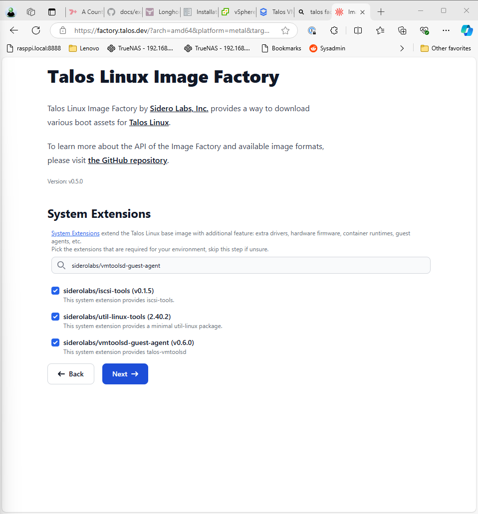

6. Select next on the Customization screen, keeping the default settings.

7. The ISO is now ready, right click on ISO and copy the ISO `URL` link.
Retain the `URL` for use in the next step.

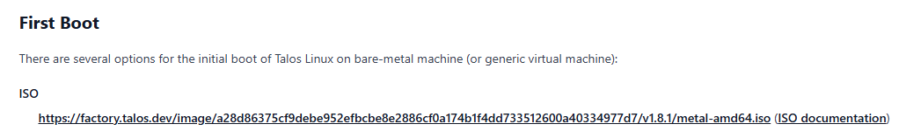

## Downloading Talos

1. Login to vSphere Client, select `Content Libraries`, then select a Content Library (e.g. `ISO`).

2. Select `Import item` and then select `URL`.

3. Paste the `URL` from the `Creating Talos iso` step above.

4. Provide an Item Name (e.g. `talos-metal-1.8.0`)

5. Select Actions > Continue on the SSL Certificate prompt for factory.talos.dev

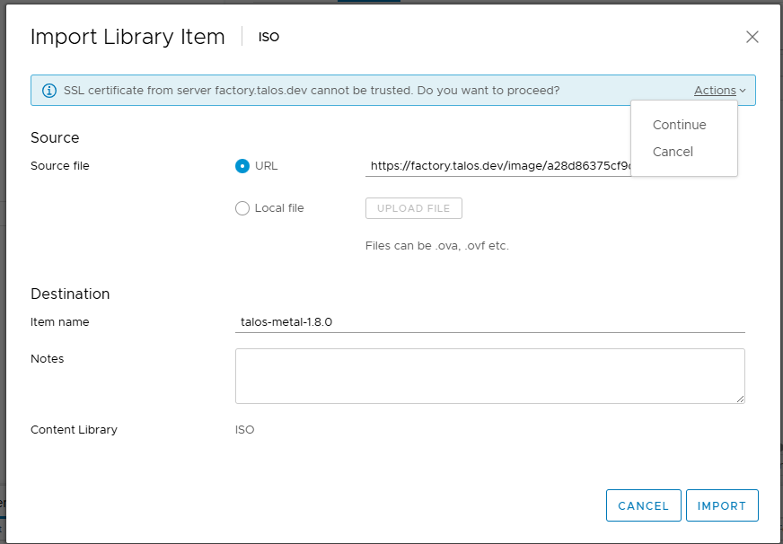

## Creating the VM

1. Select `Hosts and Clusters`, then select a node.

2. Select `Actions`, then select `New Virtual Machine`.

3. Select `Create a new Virtual Machine`.

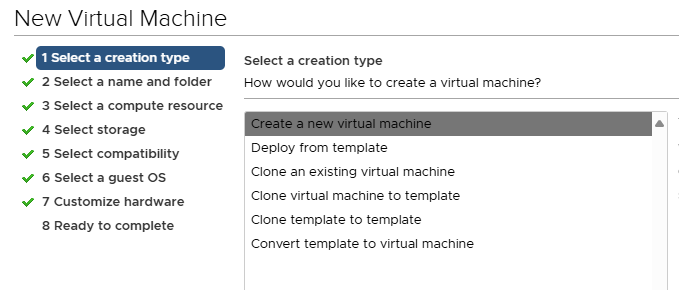

4. Enter a virtual machine name of `talos`.

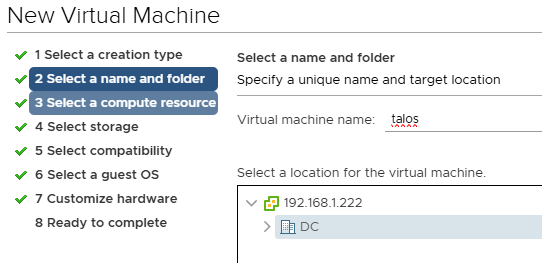

5. Select next on compute resource screen.

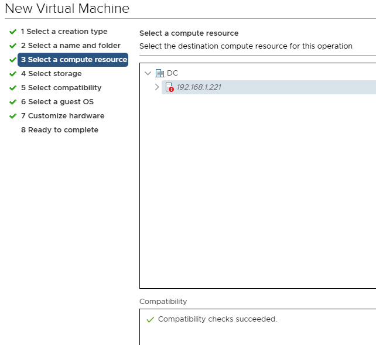

6. Select storage (e.g. `local`).

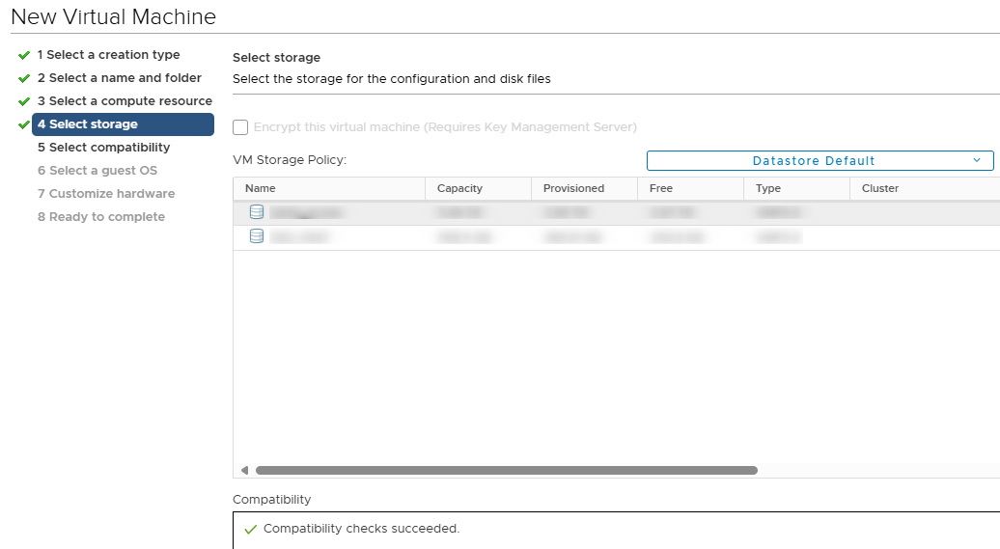

7. Select the latest available compatibility level of ESXi depending on version you are running.

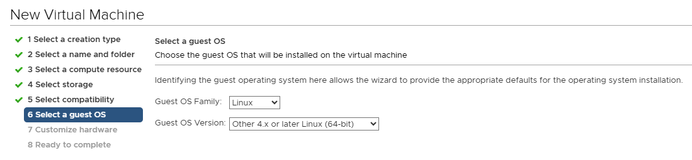

8. Select Guest OS Family `Linux` and then Guest OS Version `Other 4.x or later Linux (x64)`.

9. Select the sockets (e.g. 1) and amount of cores to be one less than the total available processor threads (e.g. if you have a 6 core processor with HyperThreading then there are 12 available threads and the value should be 11.)

10. The minimum memory value should be 16384 and the recommended value is 32768 or more Megabytes

11. Set the disk size to `500`, then select the storage repository (e.g. `local`).

12. Set the Disk Provisioning to `Thin Provision`

13. Set the CD/DVD Drive to `Content Library ISO File`, then the ISO uploaded earlier.

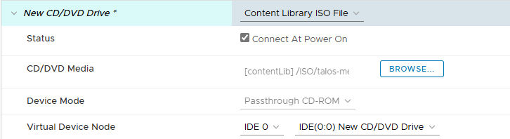

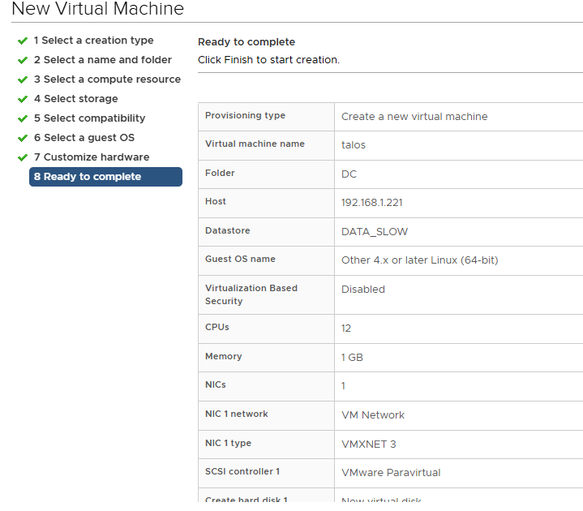

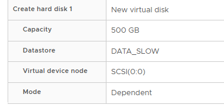

## Update Talos Config

1. Open the `clusters/main/talos/talconfig.yaml` file.

2. Find the `systemExtensions` section under controlPlane section.

3. Comment out `- siderolabs/qemu-guest-agent` with a `#` in front.

4. Paste `- siderolabs/vmtoolsd-guest-agent` above the previous line, then ensure the tabspacing of the new line matches.

5. Repeat steps 2-4 for the worker section.
