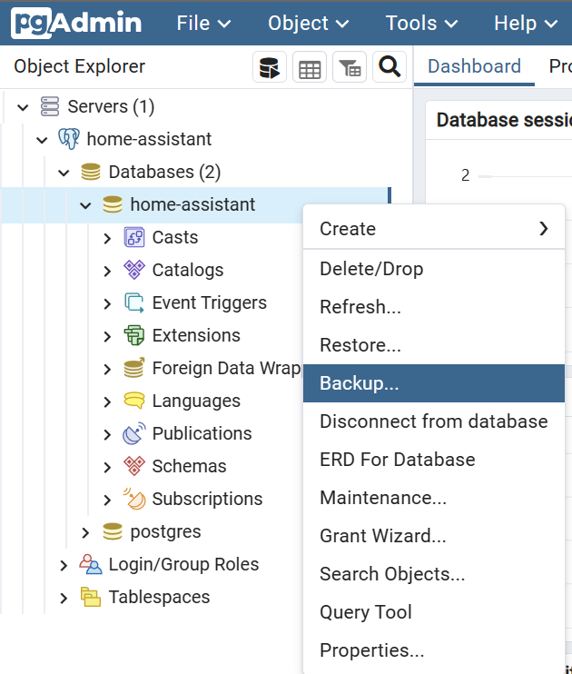

:::danger

TrueNAS SCALE Apps are considered Deprecated. We heavily recommend using a more mature Kubernetes platform such as "TalosOS" instead, and no longer offer an apps/charts catalogue for SCALE users to install. The below docs exist purely as historical references and may be removed at any time.

:::

This guide will assist you in migrating to the new CNPG operator.

## Prerequisites

1. Install PGAdmin from the TrueCharts Stable train.

2. Setup the [tcdbinfo.sh script](/deprecated/scale/guides/sql-export#how-to-list-database-login-info-for-truecharts-apps)

3. Add the system train to your TrueCharts Catalog


## Acquire Database Credentials

1. Run tcdbinfo.sh to get a list of database credentials.

```bash
bash tcdbinfo.sh
```


## Connect to CNPG Databases in PGAdmin

1. Click Add Server.


2. Choose a name for the database, this will only be used to help you identify it.


3. Enter database server and credentials previously acquired from tcdbinfo.sh script and save.


## Backup CNPG Databases

1. Right click on the database and select backup as shown below.



2. Choose a name for the database backup and click backup.


## Remove Old CNPG

1. Run the following command in system shell as root.

```bash
k3s kubectl delete --grace-period 30 --v=4 -k https://github.com/truecharts/manifests/delete2
```

## Install cloudnative-pg

1. Install cloudnative-pg from the system train, wait for it to go ACTIVE.

## Prepare CNPG Apps

1. Edit the app config of the CNPG application (home assistant in this example) and save the configuration without making any changes.

2. Wait for all pods to be created and app to be Active. This may take a few minutes. In this example Home Assistant will show ACTIVE 3/3 when its ready.

3. Get the name of the app deploy.

```bash
k3s kubectl get deploy -n ix-<app>
```

4. Stop the main pod of the app you are migrating.

```bash
k3s kubectl scale deploy <app> -n ix-<app> --replicas=0
```


## Restore CNPG Databases

1. Right click on the database and select restore as shown below in PGAdmin.


2. Select the database backup you created previously.


3. Configure Data/Objects as shown below.


4. Configure Options as shown below and click restore.


:::caution PGAdmin Error

PGAdmin may display an error during the restore process. This is known to occur and may be ignored if the app functions properly.

:::

5. Start the main pod of the app you are migrating.

```bash
k3s kubectl scale deploy <app> -n ix-<app> --replicas=1
```
