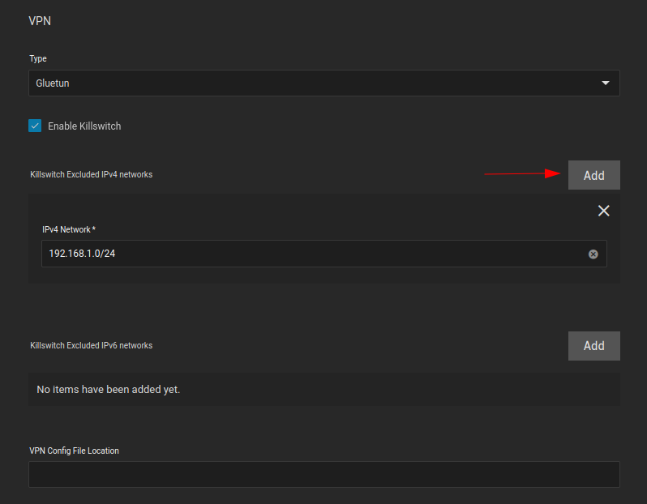
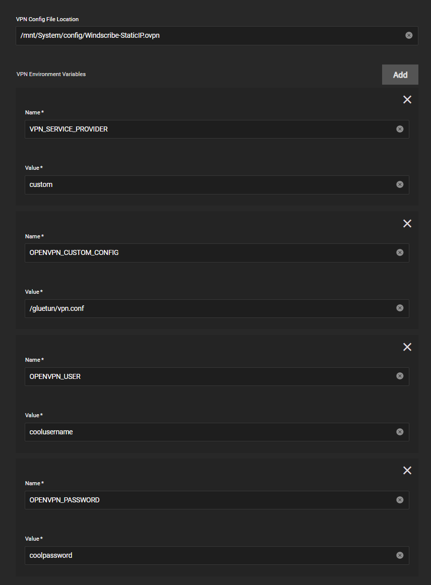

:::danger

TrueNAS SCALE Apps are considered Deprecated. We heavily recommend using a more mature Kubernetes platform such as "TalosOS" instead, and no longer offer an apps/charts catalogue for SCALE users to install. The below docs exist purely as historical references and may be removed at any time.

:::

## Gluetun VPN Add-on Setup Guide

Basic setup of the TrueCharts [Gluetun](https://github.com/qdm12/gluetun/) VPN addon

:::caution[Unique VPN Environmental Variables]

The guide below uses Mullvad and Windscribe as examples. You must visit the [Gluetun Wiki](https://github.com/qdm12/gluetun-wiki) and use the environmental variables listed for your VPN provider. Attempting to use the variables listed below will not work with any other providers and will cause Gluetun to fail during start up and the app it is attached to not to start.

:::

## Prerequisites

- Anything migrated to the new common chart that features `Gluetun`
- Ideally a VPN provider supported by `Gluetun`, check the [Gluetun Wiki](https://github.com/qdm12/gluetun-wiki) for more info.
  There are custom providers but that is beyond the scope of this guide.

## Gluetun VPN Addon Setup

- Install app as per usual and scroll down the to the `Addons` section
- Click on `VPN` and select `Gluetun`

`Gluetun` works with Environment Variables so we need to configure them below. Enter your `VPN Provider` specific ones (see below)

### OpenVPN Example

- All providers will generally need `VPN_SERVICE_PROVIDER` and `VPN_TYPE`, for me it's `Windscribe` and `openvpn` but I could easily choose `Wireguard`
- Scroll to the [Gluetun Wiki](https://github.com/qdm12/gluetun-wiki) and find your specific provider and enter their info, eg [Windscribe Wiki Page](https://github.com/qdm12/gluetun-wiki/blob/main/setup/providers/windscribe.md)

### Wireguard Example

I will demonstrate using `Mullvad` as the provider.

- I pull my private key, endpoint port and Wireguard Addresses from a `Mullvad` wireguard config file.

  

- You can generate a new config file from the `Mullvad` website, here is the [Mullvad Config Generator](https://mullvad.net/en/account/#/wireguard-config/)

Now we can enter the Env Vars

- Install app as per usual and scroll down the to the `Addons` section, click `Add` for each new environment variable

  

- Enable the killswitch by ticking `Enable Killswitch` box
- Click `Add` for every subnet you would like to exclude from the VPN tunnel. I have added my local subnet.

:::caution[Killswitch Entry]

The Killswitch entry uses the Network ID and CIDR. Please note the example above is 192.168.1.0/24. This is never your default gateway or router IP address. If you fill this entry out incorrectly Gluetun will fail to start and the application it is attached to will fail to start. In almost all situations the Network ID will end in a .0 (ie. 192.168.0.0, 10.0.0.0, 172.16.0.0) and the CIDR will be /24.

> Specifying the kubernetes subnet is not necessary as it is automatically excluded from the VPN tunnel

:::

- VPN Config File Location is not necessary, we will be using environment variables instead, so leave it blank

  

- `VPN_TYPE` is `wireguard`
- `VPN_SERVICE_PROVIDER` is `mullvad` in my case

  

- `WIREGUARD_PRIVATE_KEY` is the private key from the `Mullvad` config file above
- `FIREWALL_VPN_INPUT_PORTS` is the _port forward_ port.
- `WIREGUARD_ADDRESSES` is the `Mullvad` endpoint IP address, found in the `Mullvad` config file above

  

- `SERVER_CITIES` is the `Mullvad` server city, it should likely be in from the same city your config file is from, and should share the same city as your forwarded port.
  In my case, I am using the `Toronto` server city, and my forwarded port is from `Toronto`.
- `VPN_ENDPOINT_PORT` is the `Mullvad` endpoint port, found in the `Mullvad` config file above
- Basically same as above but needs the `VPN_TYPE` switched to `wireguard`, `WIREGUARD_PRIVATE_KEY` and `WIREGUARD_ADDRESSES`

  

## Verify it works

Easiest way to verify after it deploys (the app will fail if your credentials don't work) for me is using `qbittorrent` since the network page shows the interfaces
can be shown quickly (or check the logs), the interface will be `tun0`.

## Additional Gluetun Options

### Proxy Example

Gluetun offers HTTP (and Shadowsocks) proxy support. This is useful in scenarios when a private tracker requires the same IP address for both indexing _and_ downloading torrents. It is also generally useful if you want to route some HTTP traffic through your VPN from another container.

#### Step 1: Set the HTTP Proxy VPN Environment Variables

- `HTTPPROXY`: `on`
- `HTTPPROXY_LOG`: `on` (optional, but useful to verify initial setup)

Gluetun's default HTTP proxy port is `8888`. If you wish to change the port, then change it by adding the `HTTPPROXY_LISTENING_ADDRESS` environment variable.

See Gluetun's website for more proxy configuration options (like setting a username/password):

- [http-proxy](https://github.com/qdm12/gluetun-wiki/blob/main/setup/options/http-proxy.md)
- [shadowsocks](https://github.com/qdm12/gluetun-wiki/blob/main/setup/options/shadowsocks.md)

#### Step 2: Add a new service for the proxy

On the same app where you configured the Gluetun VPN addon proxy environment variables, add the following:

1. Under `Networking and Services` section, check `Show Expert Config`
2. Click Add for `Manual Custom Services`
   - Name: `proxy`
   - Service Type: `ClusterIP` (if you plan to use the proxy external to SCALE Apps, then set `LoadBalancer`)
   - Port Name: `proxy`
   - Port Type: `HTTP`
   - Target and Container Port: `8888` (Gluetun default for HTTP proxy)
3. Click Save

#### Step 3: Determine the proxy internal DNS name

The service name will end in `-proxy`. For an app named `qbittorrent` it will be:\
`qbittorrent-proxy.ix-qbittorrent.svc.cluster.local`.

If your app is named something different, you can look it up using

- `k3s kubectl get svc -A` or
- the DNS command in heavyscript (`heavyscript dns --all` or `heavyscript --dns -v`)

#### Step 4: Configure the proxy in your indexer app (Prowlarr)

1. In Prowlarr, under `Settings -> Indexers -> Add [Indexer Proxies]`, select `Http`
   - Name: `GluetunProxy` (or whatever name you prefer)
   - Tags: `proxy` (set this if you only want the proxy to be used on certain trackers/indexers, otherwise leave blank)
   - Host: `qbittorrent-proxy.ix-qbittorrent.svc.cluster.local`
   - Port: `8888` (or whatever port you configured)
   - Username & Password: leave blank (unless you added those env variables).
   - Click Test to confirm connection, then Save.

If you added a `proxy` tag, make sure to also add that to the desired Indexers, under `Indexers -> Edit Indexer -> Tags`.

Your indexer traffic will now be routed through the Gluetun HTTP proxy. Check the `qbittorrent-vpn` container logs to confirm.

### Custom Provider Example

If your provider isn't supported by `Gluetun` then you can use a [custom provider](https://github.com/qdm12/gluetun-wiki/blob/main/setup/providers/custom.md) and configure as below, for example here's a provider with `OpenVPN`

- Note: use `/gluetun/vpn.conf` for `OPENVPN_CUSTOM_CONFIG` and not the path specified inside the `VPN config file location` above

## Troubleshooting

To access the Gluetun logs do the following.

1. On the installed apps page, click the row for the app you are using with Gluetun.

2. In the Workloads pane on the right, click the "View Logs" icon (see image)

3. In the Containers dropdown select the log that ends with "-vpn".

