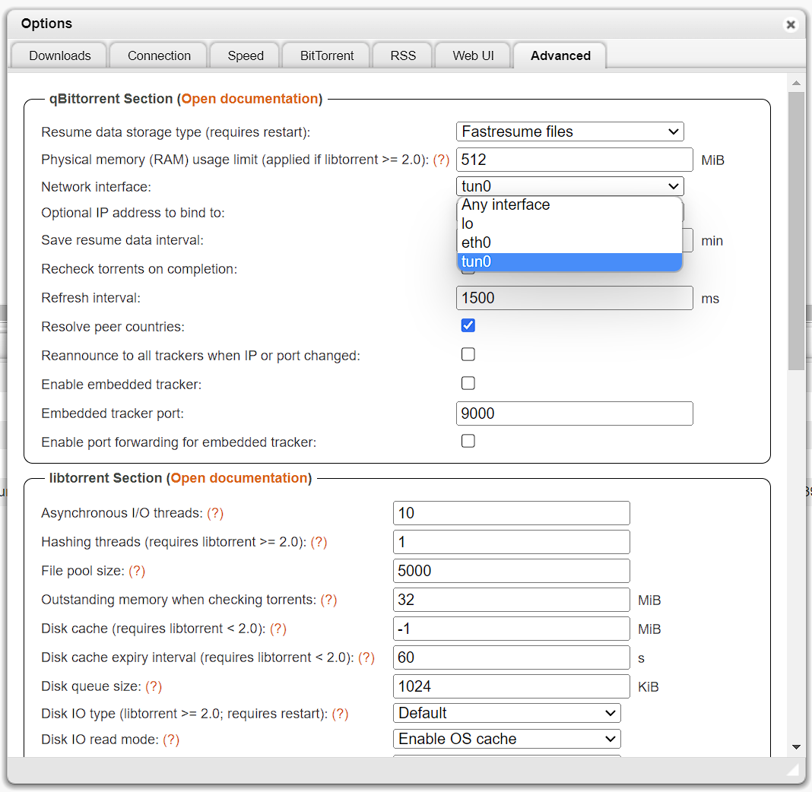

## Gluetun VPN Addon Setup Guide

Basic setup of the TrueCharts [Gluetun](https://github.com/qdm12/gluetun/) VPN addon.

:::caution[Unique VPN Environmental Variables]

The guide below uses Mullvad and Windscribe as examples. You must visit the [Gluetun Wiki](https://github.com/qdm12/gluetun-wiki) and use the environmental variables listed for your VPN provider. Attempting to use the variables listed below will not work with any other providers and will cause Gluetun to fail during start up as well as any chart it is attached to, not to start.

:::

## Prerequisites

### VPN provider

Ideally, a VPN provider supported by `Gluetun`, check the [Gluetun Wiki](https://github.com/qdm12/gluetun-wiki) for more info. There are custom providers but that is beyond the scope of this guide.

### Security restrictions

Using TalosOS and the new ClusterTool, security restrictions are more strict. So it would be possible you encounter some errors during deploying the vpn-addon, like:

`Error creating: pods "xxxxx" is forbidden: violates PodSecurity "baseline:latest": non-default capabilities (container "xxxxx" must not include "NET_ADMIN", "NET_RAW" in securityContext.capabilities.add)`

In that case you need to review your namespace. Adding privileged to your name space can be done as follow:

`kubectl label --overwrite ns <NAMESPACE> pod-security.kubernetes.io/enforce=privileged`

More information can be find on the kubernetes [website](https://kubernetes.io/docs/tasks/configure-pod-container/enforce-standards-namespace-labels/).

## Gluetun VPN Addon Setup

Install the chart as per usual and add the the section for Gluetun like shown below. Don't forget to set your Network in the `excludedNetworks_IPv4` and enable the killswitch if desired, as shown below

```yaml
addons:
  gluetun:
    enabled: true
    container:
      env:
        FIREWALL: "on"
        FIREWALL_OUTBOUND_SUBNETS: "192.168.178.0/24"
```

`Gluetun` works with Environment Variables so we need to configure them below. Enter your `VPN Provider` specific ones as below.

### OpenVPN Example

```yaml
addons:
  gluetun:
    enabled: true
    container:
      env:
        FIREWALL: "on"
        FIREWALL_OUTBOUND_SUBNETS: "192.168.178.0/24"
        VPN_SERVICE_PROVIDER: "windscribe"
        VPN_TYPE: "openvpn"
        OPENVPN_USER: "username"
        OPENVPN_PASSWORD: "password"
        SERVER_REGIONS: "Canada East"
        SERVER_CITIES: "Montreal"
```

All providers will generally need `VPN_SERVICE_PROVIDER` and `VPN_TYPE`. For me, it's `Windscribe` and `openvpn` but I could easily choose `Wireguard`.

Check the [Gluetun Wiki](https://github.com/qdm12/gluetun-wiki) to find your specific provider and enter their info, e.g. [Windscribe Wiki Page](https://github.com/qdm12/gluetun-wiki/blob/main/setup/providers/windscribe.md).

### Wireguard Example

I will demonstrate Wireguard VPN setup using `Mullvad` as the provider. I pull my private key, endpoint port and Wireguard Addresses from a `Mullvad` wireguard config file.


You can generate a new config file from the `Mullvad` website, here is the [Mullvad Config Generator](https://mullvad.net/en/account/#/wireguard-config/).

Now we can enter the Env Vars. Install the chart as per usual and add the specific env vars to the gluetun section:

```yaml
addons:
  gluetun:
    enabled: true
    container:
      env:
        FIREWALL: "on"
        FIREWALL_OUTBOUND_SUBNETS: "192.168.178.0/24"
        VPN_TYPE: "wireguard"
        VPN_SERVICE_PROVIDER: "mullvad"
        WIREGUARD_PRIVATE_KEY: "xxxxxxx"
        FIREWALL_VPN_INPUT_PORTS: "59241"
        WIREGUARD_ADDRESSES: "xxx.xxx.xxx.xxx/32"
        SERVER_CITIES: "Torronto"
        VPN_ENDPOINT_PORT: "51820"
        WIREGUARD_PUBLIC_KEY: "xxxxxxxx"
        VPN_ENDPOINT_IP: "xx.xx.xxx.xxx"
```

:::caution[Killswitch Entry]

The Killswitch entry uses the Network ID and CIDR. Please note the example above is 192.168.1.0/24. This is never your default gateway or router IP address. If you fill this entry out incorrectly, Gluetun will fail to start and the chart it is attached to will also fail to start. In almost all situations the Network ID will end in a .0 (ie. 192.168.0.0, 10.0.0.0, 172.16.0.0) and the CIDR will be /24.

> Specifying the kubernetes subnet is not necessary as it is automatically excluded from the VPN tunnel

:::

- VPN Config File Location is not necessary, we will be using environment variables instead, so leave it blank
- `VPN_TYPE` is `wireguard`
- `VPN_SERVICE_PROVIDER` is `mullvad` in my case
- `WIREGUARD_PRIVATE_KEY` is the private key from the `Mullvad` config file above
- `WIREGUARD_PUBLIC_KEY` is the public key from the `Mullvad` config file above
- `FIREWALL_VPN_INPUT_PORTS` is the _port forward_ port
- `WIREGUARD_ADDRESSES` is the `Mullvad` endpoint IP address, found in the `Mullvad` config file above
- `SERVER_CITIES` is the `Mullvad` server city, it should likely be in from the same city your config file is from, and should share the same city as your forwarded port
  In my case, I am using the `Toronto` server city, and my forwarded port is from `Toronto`
- `VPN_ENDPOINT_PORT` and `VPN_ENDPOINT_IP` is the `Mullvad` endpoint port and ip, found in the `Mullvad` config file above.

## Verify it works

The easiest way to verify after it deploys (the chart will fail if your credentials don't work) for me is using `qbittorrent` since the network page showing the interfaces
can be shown quickly (or check the logs), the interface will be `tun0`.



## Additional Gluetun Options

### Proxy Example

Gluetun offers HTTP (and Shadowsocks) proxy support. This is useful in scenarios when a private tracker requires the same IP address for both indexing _and_ downloading torrents. It is also generally useful if you want to route some HTTP traffic through your VPN from another container.

#### Step 1: Set the HTTP Proxy VPN Environment Variables

Those env have to be set additionally to your VPN setup from above.

- `HTTPPROXY`: `on`
- `HTTPPROXY_LOG`: `on` (optional, but useful to verify initial setup)
- `HTTPPROXY_LISTENING_ADDRESS`: `:8888` (optional)
- `FIREWALL_INPUT_PORTS`: `10095,8888`

```yaml
addons:
  gluetun:
    enabled: true
    container:
      env:
        FIREWALL: "on"
        FIREWALL_OUTBOUND_SUBNETS: "192.168.178.0/24"
        HTTPPROXY: "on"
        FIREWALL_INPUT_PORTS: 10095,8888
        #optional
        HTTPPROXY_LOG: "on"
        HTTPPROXY_LISTENING_ADDRESS: :8888
```

Only the additional ENV needed for the Proxy are shown here to keep it shorter. You still need your VPN setup from above.

Gluetun's default HTTP proxy port is `8888`. If you wish to change the port, then change it by adding the `HTTPPROXY_LISTENING_ADDRESS` environment variable.

See Gluetun's website for more proxy configuration options (like setting a username/password):

- [http-proxy](https://github.com/qdm12/gluetun-wiki/blob/main/setup/options/http-proxy.md)
- [shadowsocks](https://github.com/qdm12/gluetun-wiki/blob/main/setup/options/shadowsocks.md)

#### Step 2: Add a new service for the proxy

On the same chart where you configured the Gluetun VPN addon proxy environment variables, add the following additional service to your values.yaml as shown below. If you want to use said Proxy outside your Cluster you need to setup a LoadBalancer.

```yaml
service:
  proxy:
    enabled: true
    ports:
      gluetun:
        enabled: true
        port: 8888
        protocol: "http"
        targetPort: 8888
    type: "ClusterIP"
  ```

#### Step 3: Determine the proxy internal DNS name

The service name will end in `-proxy`. For a chart named `qbittorrent` it will be:

`qbittorrent-proxy.ix-qbittorrent.svc.cluster.local`

If your chart is named something different, you can look it up using `k3s kubectl get svc -A`.

#### Step 4: Configure the proxy in your indexer chart (Prowlarr)

In Prowlarr, under `Settings -> Indexers -> Add [Indexer Proxies]`, select `Http`

   - Name: `GluetunProxy` (or whatever name you prefer)
   - Tags: `proxy` (set this if you only want the proxy to be used on certain trackers/indexers, otherwise leave blank)
   - Host: `qbittorrent-proxy.ix-qbittorrent.svc.cluster.local`
   - Port: `8888` (or whatever port you configured)
   - Username & Password: leave blank (unless you added those env variables).
   - Click Test to confirm connection, then Save.


If you added a `proxy` tag, make sure to also add that to the desired Indexers, under `Indexers -> Edit Indexer -> Tags`.

Your indexer traffic will now be routed through the Gluetun HTTP proxy. Check the `qbittorrent-vpn` container logs to confirm.

## Talos specific config

In talos in order to use the tun interface for Gluetun a workaround is needed otherwise you will get an error with permissions creating the tun interface.

### Step 1: Add the generic-device-plugin

Install the generic-device-plugin from our helm chart repository. Make sure to make the namespace privileged.

### Step 2: Add this into your hvalues for your app

Here is an example snippet on how to add it:

```yaml
addons:
  gluetun:
    enabled: true
    container:
      resources:
        limits:
          truecharts.org/tun: 1
```
