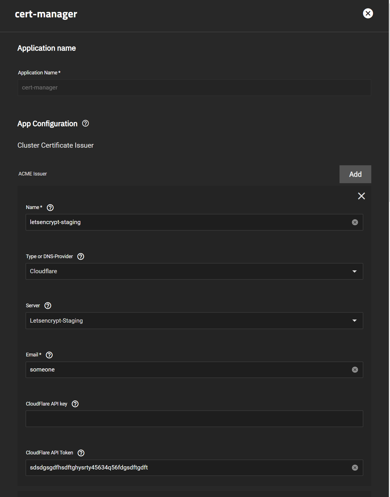
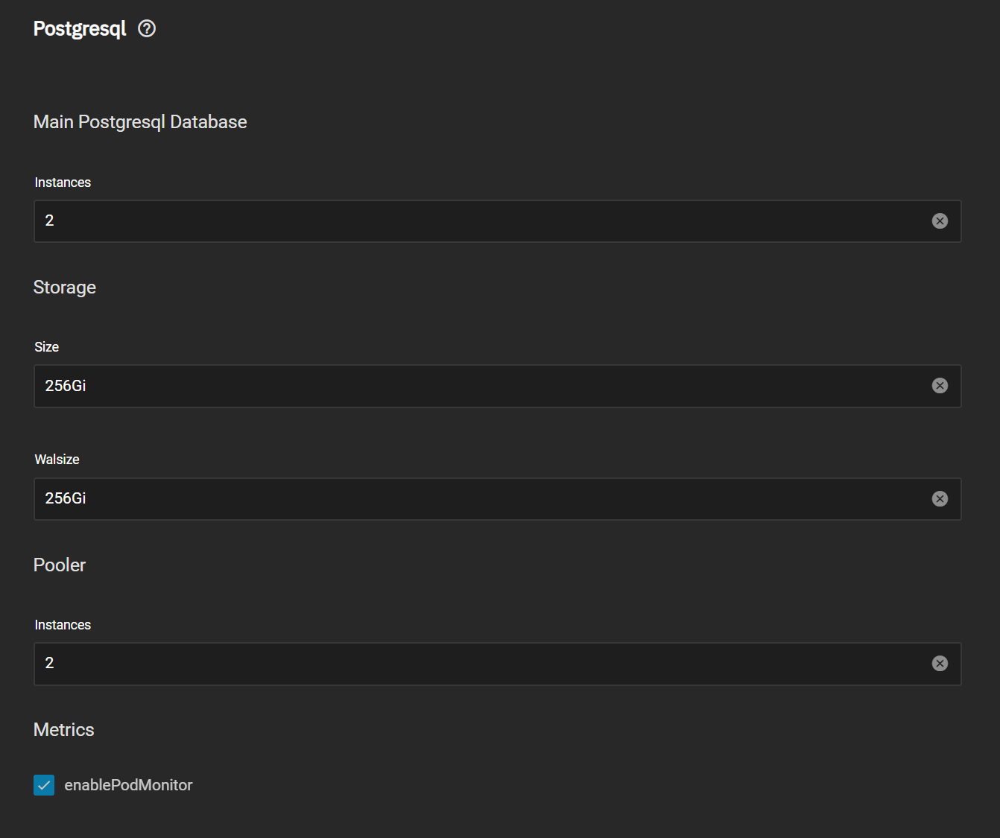

As part of our March breaking change update of all our apps, we're glad to announce the first round of updates:

- Dependency train has been updated, except "Collabora" and "Postgresql" which will be moved to the "stable" train later
- Enterprise train has been updated
- Vaultwarden has been added to the enterprise train
- Authelia has been added to the enterprise train
- Blocky gained backend support for more query logging options, which will later be added the the TrueNAS SCALE GUI.

We've done considerable testing to validate if, and how, we could add automated migration. But the changes are so significant, that the chance of things breaking is many times too high. So while we're sorry for the inconvenience, users will likely have to reinstall many of their Apps this month.

Luckily enough, the enterprise train did not contain anything using Postgresql databases, so you don't have to worry about updates nuking databases.

But on the topic of nuking databases:
We're working internally on a script to export all your postgresql databases, which will be released before the stable train will get it's round of updates.
That way you don't have to manually export all those sql files.

## Important

We want to repeat that this will be a breaking change.
While **some** Apps/Charts might update without issue, many will not.

In those cases, the only solution is to reinstall. Due to the fact that the complete backend is rewritten from scratch, it's simply too much for us to write.

## Highlighted changes

We want to highlight some of the biggest changes, as there are some real showstealers in this update to make it worth it!

### Cert-Manager Certificates

We're heard many of you complain about flaky and limited certificate behavior on TrueNAS SCALE. It's understandable people are upset and so are we.

To ensure users have an actually solid experience, we've decided to implement the current industry leading certificates solution: Cert-Manager.
It supports more forms of certificates, is faster to setup and is build by people that are _actually_ specialized in certificate management. Which, lets be realistic, NAS developers are not.

Later this month, we'll release some guides for setting it up, but here's some screenshots:

### Configurable Cloud Native Postgresql

This is our biggest change this release. We moved to a completely different postgresql backend. Backed by CloudNative Postgresql, a kubernetes operator for postgresql.

You might ask "what the heck is an operator", in short it's a solution to have a specialized project maintain deployments of things within kubernetes.
They write code to ensure things like: updates, upscaling, downscaling and deployment go smoothly. Basically the same thing as Cert-Manager does for certificates, CloudNative Postgresql does for Postgresql Databases.

The upside to this is that we can be certain your database deployments are designed by people that are specialized in the database you want to have deployed. It limits your risk of data-loss and our work of maintaining it.
Simply put, your database deployments should be managed by a specialist in databases, not by NAS or Helm-Charts developers.

## Enterprise Train and breaking changes

We also want to announce and put-in-place a new breaking-changes policy for the Enterprise train. Which will take effect 01-04-2023:

- All Charts in the Enterprise train, will get one-by-one attention to write migration scripts where possible
- If there are breaking changes, we will write migration guides for each of them, customized where needed
- Breaking changes will be announced _at least_ 3 months in advance and older versions (pre-breaking-change) will continue to be supported for _at least_ 3 months afterwards (so at least 6 months after the announcement of a breaking change)
- In the future help with migrations will, obviously, be included in the priority enterprise support packages that come with our future SLA offerings for the Enterprise Apps

These measure should ensure users that require our Apps for production use, are not surprised again with unwanted breaking changes in the future.
While, at the same time, everything stays available for everyone to work with, for free.
