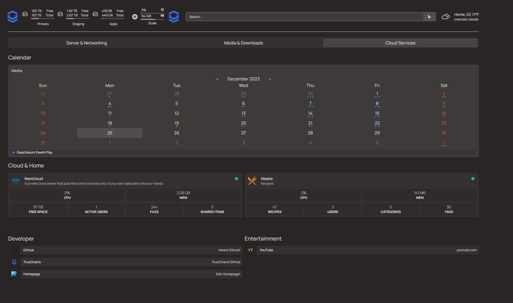

We are delighted to announce the successful integration of Homepage into our charts.

To fully utilize this new feature, there are two initial steps that need to be performed: installing Homepage on your system and enabling integrations for Homepage in application deployments for the apps you want to show. Our comprehensive [Homepage Integration Guide](/charts/stable/homepage/hp-integration/) provides detailed instructions for both of these processes, ensuring a smooth setup.

Once these steps are completed, you can activate Kubernetes support in Homepage. This allows you to view your applications and their statuses on a customizable dashboard. Additionally, the code-server addon can be used to organize and arrange applications by editing various YAML files.

Don't forget to check out the [Homepage project site](https://gethomepage.dev).

Here's a small example showcasing a mix of manually defined options and TrueCharts integration features for Homepage:

