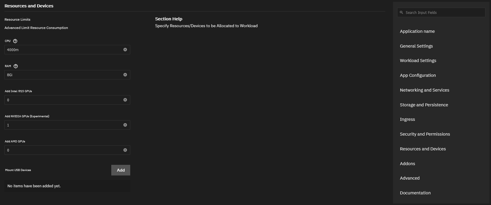
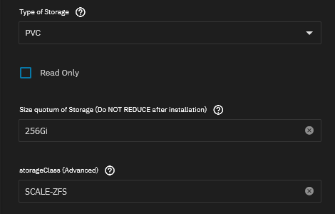

There have been some minor changes to how some things are done on SCALE.
None of them will require a reinstall and the migration steps are not going to cause any likely breakage.

## Nextcloud

Nextcloud has moved to the enterprise train.
To migrate from `stable` to `enterprise` train versions, run the following command in SCALE terminal:
`k3s kubectl patch ns ix-nextcloud -p '{"metadata":{"labels":{"catalog_train":"enterprise"}}}'`

If not using the `root` user, please prefix this with `sudo`

## GPUs

We've decided to remove the SCALE-specific way of handling GPU loading, in favor of the "normal" way it's done in kubernetes.
One of the reasons why we've decided to do this, is the fact that the language used by iX-Systems is very confusing for the user and adding their custom middleware on-top of normal kubernetes makes it less reliable.

In short, this means you will have to specify the number of GPU's to assign to an App under `Resources and Devices` and then the `Resource Limits` section, with your specific GPU type (either AMD, NVIDIA or Intel) as below:

From an end-user perspective, the option has just moved to a slightly different place and instead of a drop-down you'll have to enter a number of GPU's to assign, `1` in most cases.

## Pre-DragonFish Storage

To make it easier to migrate to DragonFish, all users are advised to set any-and-all references to "StorageClass" to `SCALE-ZFS` for any existing charts/apps. This option is found under the `Storage and Persistence` section as below:

This ensures those charts/apps stay working after migrating to TrueNAS SCALE DragonFish in the future.

If you do not do this, we cannot guarantee your data stays in tact when you move to DragonFish in the future.

## Technical Common Changes

These changes do not affect end-users of the charts/apps, but are breaking changes in the common library if used directly by DIY/experienced users building their own helm charts.

### Removal of SCALE certificates support

After removing SCALE Certificates support from our GUI setup, we've now also removed it from the common library chart.

### Removal of iXVolumes

iXVolumes was the weird storage solution designed by iX-Systems that created hostPath mounted datasets, automatically.
A bit like PVC, but without complying to any industry standards.

We've never been using it, nor ever supported it in our charts.
Hence we've decided to remove it from the common library chart as well.

### Removal of SCALE GPU

Besides the removal of SCALE GPU GUI from the end-user GUI, it's also completely scrubbed from the common library-chart as it is completely replaced.
